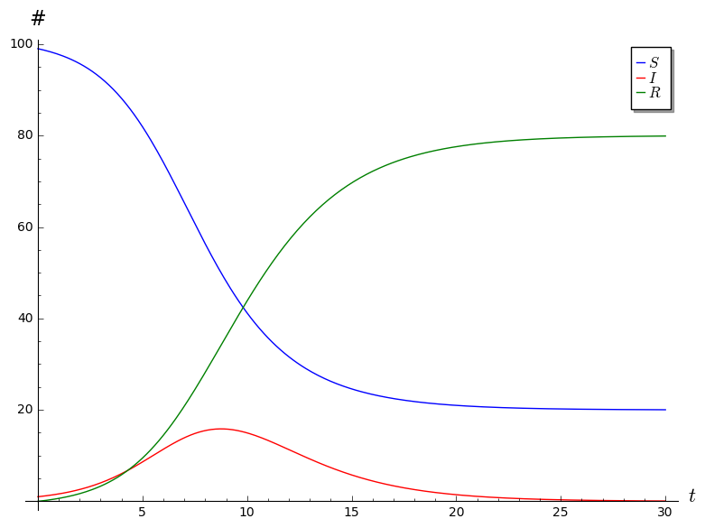

# SIR Project Comments

Here are some of the common mistakes I noticed when going through the SIR projects.

* Part I
    * Question 2. I was looking for the observation that b and c are both forced to be between 0 and 1, since they are both fractions.

    * Question 3. I was looking for something along the lines of the following: Since $S + I + R = N$ is constant, we have
    $$0 = (S + I + R)' = S' + I' + R',$$
    which means that $I' = - S' - R'$.

    * Question 5. All of you said that $S \to 0$ as $t \to \infty$. That's fine, and I didn't take off points for this, but this is not quite true: all that we know is that $S$ must stabilize at some value between 0 and $N$ (because it's monotonically decreasing and bounded), but there is no guarantee that that value be 0. This will happen when the disease is not very virulent: recovery happens quickly (ie, $c$ is large), and the disease speads slowly (ie, $b$ is small). Here is a picture of this kind of situation. In this plot, we have $c = 0.5$, $b = 0.01$, $R(0) = 0$, and $I(0) = 1$.
        

        Here's a question I have: must it be the case that $I \to 0$ as $t \to \infty$? It seems like this should be true, and I haven't been able to come up with a counterexample, but I don't know how to prove this directly from the differential equations...

    * Question 6. I was looking for something along the following lines: Observe that
    $$ \frac{dI}{dt} = bSI - cI = b\left(S - \frac{c}{b} \right)I.$$
    We know that $b > 0$, so the sign of $dI/dt$ matches the sign of $S - c/b$. Suppose $S(0) < c/b$. Since $dS/dt < 0$, we know that $S$ is monotonically decreasing, so $S(t) < c/b$ for all $t$. Thus $dI/dt < 0$, which means that $I$ is monotonically decreasing.

        This analysis also tells us that, even if $S(0) \geq c/b$, as soon as we hit a time $t_0$ such that $S(t_0) < c/b$, the infected population will decrease after $t_0$.

        It is also worth pointing out that you *cannot* conclude that $I = e^{(bS - c)t}$, since $S$ is itself varying with time! If you differentiate $e^{(bS-c)t}$ with respect to time, keeping in mind the chain and product rules, you find that
        $$ \frac{d}{dt}e^{(bS-c)t} = \left(b \frac{dS}{dt} + (bS-c) \right) e^{(bS-c)t} $$
        which shows that $I = e^{(bS-c)t}$ does not satisfy the differential equation that $I$ needs to satisfy.

    * Question 7. This is very confusing, so I didn't take off any points here no matter what you said. Probably when I revise this project for the next time I teach ODEs I'll add some hints about this. That said, here are some thoughts.

        First of all, notice that, in order for the units on the equation for $dS/dt$ to work out, $b$ needs to have units $1/(\text{people} \cdot \text{days})$. Then, in order for the units on the equation for $dR/dt$ to work out, $c$ needs to have units $1/\text{days}$. This means that the units on the quantity $c/b$ is people. (This makes some sense, since in the previous problem, we were comparing $S$ and $c/b$. We know that $S$ has units people, and a comparison between two quantities only makes sense if the two have the same units.)

        But what number of people is $c/b$? Well, on a particular day, we have
        $$ c = \frac{\text{new recoveries}}{\text{infected}} $$
        and
        $$ b = \frac{ \frac{\text{new infections}}{\text{susceptible}} }{\text{infected}} $$
        which means that
        $$ \frac{c}{b} = \frac{ \text{new recoveries} }{ \text{new infections} } \cdot \text{susceptible}. $$
        In other words, $c/b$ is the answer to the following question: if all of the susceptible people become newly infected on a particular day, how many people would recover on that day?

        Another interpretation for $c/b$ falls out of the analysis we did in the previous question. More specifically, $c/b$ marks a "critical population" of susceptibles: the pointn when $S = c/b$ is the point when the infected population will start decreasing.

        One final interpretation is that $c/b$ is that this is some kind of a measure of the virulence of the disease (or rather, non-virulence): as $c/b$ decreases towards 0, the infection spreads more and more rapidly. This is probably the easiest interpretation to see, but it's a little vague and the units of $c/b$ are completely opaque in this interpretation.

* Part II
    * Question 3. The maximum infected population happens around $t = 7.1$, when the infected population is about 273335. In other words, I was looking for something along the lines of "around day 7."

    * Question 6. 90% recovery happens somewhere between $t = 17.1$ and $t = 17.2$. In other words, I was looking for something like "around day 17."
