# Lab Solutions

## Lab 1

1. `arbuthnot$girls`
2. It looks like there's a generally upwards trend. 

	
3. We generate the plot using the following command. 
 
	~~~R
	plot(arbuthnot$year, arbuthnot$boys / (arbuthnot$boys +  arbuthnot$girls), type = "l")	
	~~~

	The result is the following. It looks like it fluctuates a lot, but always stays solidly above 0.5. 
	
	
	
4. We use the command 

    ```R
    present <- read.csv("https://sagrawalx.github.io/fa21-b1_ma117/labs/present.csv")
    ```

5. The data is from years 1940--2002. There are 63 rows and 3 columns; the column names are `year`, `boys`, and `girls`.

6. The birth counts are not on a similar scale: the present data set counts births in the millions, while Arbuthnot's counts births in the thousands.
    
7. There ratio fluctuates a lot, but there's a vaguely decreasing trend. In any case, the noteworthy observation here is that this ratio is always solidly above 1. 
	
	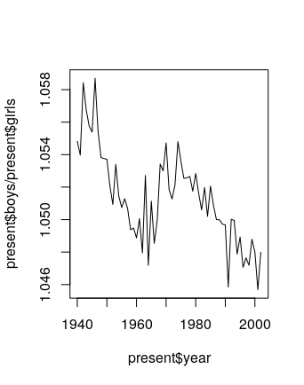
	
	Note: This is consistent with the observation that developed countries (ie, ones which don't have issues involving sex-selective abortions) tend to have a sex ratio at birth of roughly 1.05 males per female. This in spite of the fact that the females are slightly more numerous in the overall population, since women tend to live longer than men. Depending on how much outside reading the students did, they may say some of this, but they should at least observe that the sex ratio in the plot above is always solidly above 1. 
	
8. The largest number of total births happened in 1961. To figure this out in R, we note that 
	
	~~~R
	which.max(present$boys + present$girls)
	~~~
	returns the index of the largest entry of the vector `present$boys + present$girls`, which happens to be 22. Then, running 

	~~~R
	present[22,1]
	~~~
	then returns the entry in row 22 and column 1 (ie, the year corresponding to index 22), which happens to be 1961. 

	We can also put all of this together; the command
	
	~~~R
	present[which.max(present$boys + present$girls), 1]
	~~~
	returns the answer 1961 in just one line. 

# Lab 2

1. There are 20000 cases and 9 variables. `genhlth`, `exerany`, `hlthplan`, `smoke100`, and `gender` are categorical, while `height`, `weight`, `wtdesire`, and `age` are numerical. 

2. For `height` and `age`, we get the following numerical summaries, and the interquartile ranges are 6 and 26, respectively. 
	
	~~~R
    > summary(cdc$height)
       Min. 1st Qu.  Median    Mean 3rd Qu.    Max. 
      48.00   64.00   67.00   67.18   70.00   93.00 
	> summary(cdc$age)
	   Min. 1st Qu.  Median    Mean 3rd Qu.    Max. 
	  18.00   31.00   43.00   45.07   57.00   99.00
	~~~

	For `gender` and `exerany`, we have the following relative frequency distributions. 

	~~~R
	> table(cdc$gender)/20000

		  m       f 
	0.47845 0.52155
	> table(cdc$exerany)/20000

		 0      1 
	0.2543 0.7457 
	~~~

	There are 9569 males in the sample, and 23.285% of the sample population reports being in excellent health. 

3. The mosaic plot (below) shows that relatively more men report having smoked 100 cigarettes than women. 

	

4. `under23_and_smoke <- subset(cdc, age < 23 & smoke100 == "1")`

5. The box plot of `genhlth` against `bmi` shows that decreasing health appears to coincide with higher BMIs. 

	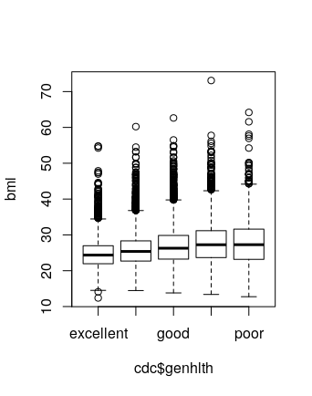

	Here is a box plot of `hlthplan` against `bmi`. It appears that having a health plan is correlated with fewer extreme BMIs. 

	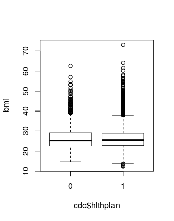
	
	Note: students might choose different variables here. 

6. The scatterplot shows a generally positive trend, but the slope appears to be less than 1. 

	
	
	Note: Students might interchange axes, and that's fine. 

7. `wdiff <- cdc$weight - cdc$wtdesire`

    Note: Students could subtract the other way around too. That's fine, but note that if they do that, their answers to the question below will be a little different as well. 

8. `wdiff` is a vector of continuous numerical observations. An entry of 0 means that person is at their desired weight. An positive entry indicates the person wants to lose weight, and a negative entry indicates they want to gain weight.

9. Running `hist(wdiff,breaks=50)` and `boxplot(wdiff)` yield the following plots. 

	 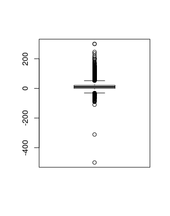

	It appears that most people are happy with their weights, but there is more of a skew towards the positive side (ie, more people want to lose weight than gain). 

5. Here are numerical summaries. 

	~~~R
	> cdc$wdiff <- wdiff
	> male <- subset(cdc, gender=="m")
	> female <- subset(cdc, gender=="f")
	> summary(male$wdiff)
	   Min. 1st Qu.  Median    Mean 3rd Qu.    Max. 
	-500.00    0.00    5.00   10.71   20.00  300.00 
	> summary(female$wdiff)
	   Min. 1st Qu.  Median    Mean 3rd Qu.    Max. 
	 -83.00    0.00   10.00   18.15   27.00  300.00 
	~~~

	And here is a side-by-side box plot. It appears that women generally want to lose more weight (comparing mean and/or medians).

	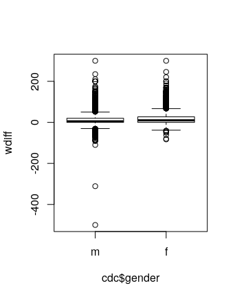 

6. It appears that 70.76% of the weights are within one standard deviation of the mean. 

	~~~R
	> m <- mean(cdc$weight)
	> s <- sd(cdc$weight)
	> within_one_sd <- subset(cdc, weight > m-s & weight < m+s)
	> dim(within_one_sd)
	[1] 14152    10
	> 14152/20000
	[1] 0.7076
	~~~
	
	Note: It is not correct if students just assume that `weight` is normally distributed and use the 68-95-99.7 rule. They should actually calculate the proportion of observations that are within one standard deviation. 

# Lab 3

1. There is always exactly one miss in any streak. A streak of 1 has one hit and one miss. A streak of 0 has just one miss. 

2. There are fewer and fewer longer streaks. The longest streak was 4, though the most frequent was 0. 
	
	

3. 21 heads, 79 tails. 

    Note: Others might have different answers here, since this is a random simulation. 

4. `sim_basket = sample(outcomes, size = 133, replace = TRUE, prob = c(0.45, 0.55))`

5. There are fewer and fewer longer streaks. The longest streak was 7, but the most frequent was 0. 
	
	

6. If we run the simulation again, the distribution should be similar, but not necessarily identical. Sometimes the longest streak is 4, sometimes it gets as long as 10, but it's never terribly different from this. 

7. My simulations do not give evidence that Kobe has hot hands. All of the simulations I ran were either similar to Kobe's distribution, or had even longer streaks! 

# Lab 4

1. Here are the distributions, overlaid one on top of the other.

	

	Women tend to be less tall. But both distributions are roughly normal. I used 

    ```R
    ggplot(bdims, aes(x=hgt, color=sex)) + geom_histogram(fill="white", alpha=0.5, position="identity")
    ```
	
	Note: I apparently decided to use `ggplot` here. Students don't need to do this. 

2. It does appear roughly normal. 

	

3. The Q-Q plot of the simulated data looks an awful lot like the Q-Q plot of the real data.

	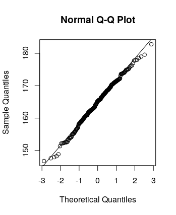

4. The plots do provide evidence that female heights are nearly normal. 

5.  Female weights seem less normally distributed than heights. 

	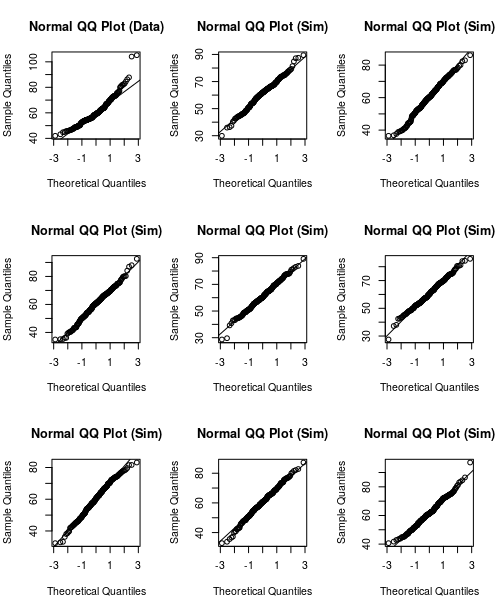

6. What is the probability that female heights are less than 178? The normal distribution says 97.8%, the actual data says 98.1%. 

	What is the probability that female weights are less than 61? The normal distribution says 51.7%, the actual data says 59.2%. 

	The answer for the height distribution is much closer. 

7. B, C, D, A
    
8. The Q-Q plot and the histogram are displayed below. In the Q-Q plot, the data lies above the line. This means that sample quantiles are above theoretical quantiles, which means that at any given point, we've seen *more* data than we would expect if the distribution was normally distributed. This means that the mass of the distribution is further to the left, so the distribution should be right skewed. This is confirmed by the histogram. 

	

	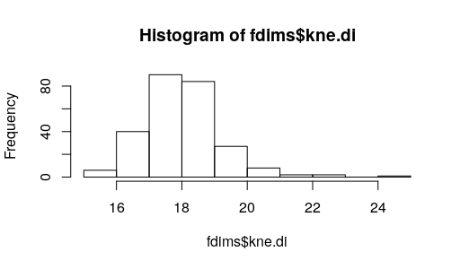

# Lab 5

1. The distribution is slightly right skewed. The mean, at 1500, is slightly higher than the median, at 1442. 

	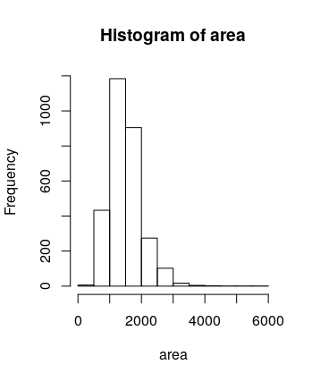

2. `samp1` has a less bell-curved-looking distribution, though it is still right skewed. The mean is 1486.42. 

    Note: There is randomness involved here. Students' answers may differ slightly. 

3. `samp2` had a mean of 1418.44, which was less than the mean of `samp1`. If we took a larger sample, the sample mean should be closer to the true mean. 
    
    Note: There is randomness involved here. Students' answers may differ slightly. 

4. There are 5000 elements. The distribution is roughly normal, centered at 1500. If we took 50000 means, the distribution should still look roughly normal centered at 1500. 

5. There are 100 elements. Each is a mean of a sample of 50 areas. 

	~~~R
	> sample_means_small
	  [1] 1636.96 1512.40 1400.68 1539.86 1584.10 1513.30
	  [7] 1488.74 1395.66 1524.02 1537.40 1520.12 1479.32
	 [13] 1385.42 1502.90 1532.00 1510.06 1542.00 1429.46
	 [19] 1361.28 1577.32 1496.66 1592.52 1464.08 1580.18
	 [25] 1689.26 1403.20 1473.34 1465.64 1389.28 1464.44
	 [31] 1560.10 1611.22 1551.54 1393.10 1616.98 1554.44
	 [37] 1494.38 1368.18 1508.28 1492.74 1453.42 1406.52
	 [43] 1525.18 1561.12 1408.74 1468.86 1403.62 1471.80
	 [49] 1524.42 1565.74 1524.10 1514.20 1556.24 1509.26
	 [55] 1509.12 1501.52 1595.48 1437.08 1483.24 1581.10
	 [61] 1613.56 1527.60 1466.04 1548.70 1548.04 1539.76
	 [67] 1524.82 1532.24 1487.40 1498.16 1343.76 1566.02
	 [73] 1622.50 1438.38 1475.00 1514.18 1521.56 1581.84
	 [79] 1492.78 1443.68 1467.14 1482.70 1572.48 1450.32
	 [85] 1564.26 1462.30 1595.52 1645.76 1526.34 1513.40
	 [91] 1575.64 1511.74 1451.78 1528.62 1525.22 1454.78
	 [97] 1423.96 1572.24 1451.92 1566.10
	~~~

6. When the sample size is larger, the variability decreases. 

	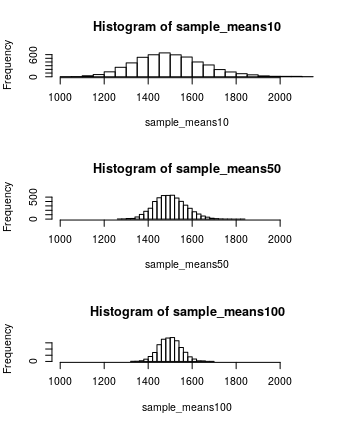

7. Running `mean(sample(price, 50))` yields 169726.3. 

    Note: There is randomness involved here. 

8. To generate `sample_means50`, we run the following: 

    ```R
    sample_means50 <- rep(NA, 5000)

    for(i in 1:5000) {
      samp <- sample(price, 50)
      sample_means50[i] <- mean(samp)
    }
    ```

    Here is the distribution. It is normal, with mean 181027. The true mean is 180796.1. 

	
	
	Note: There is randomness involved here, so answers might differ slightly (but probably not a lot). 

9. To generate `sample_means150`, we run the following: 

    ```R
    sample_means150 <- rep(NA, 5000)

    for(i in 1:5000) {
      samp <- sample(price, 150)
      sample_means150[i] <- mean(samp)
    }
    ```

    Here is the distribution for `sample_means150`. It is also normal, with mean 180649. This is a little closer to the true mean. 

	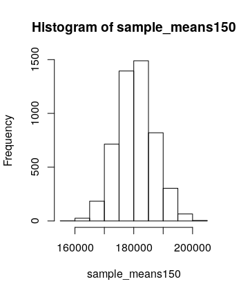
	
	Note: There is randomness involved here, so answers might differ slightly (but probably not a lot). 

10. `sample_means150` has a narrower distribution than `sample_means50`, and this can be quantified by comparing the standard deviations. If we want to be more confident about our estimate, we should use a distribution with a narrower distribution (ie, we should take larger sample sizes). 

	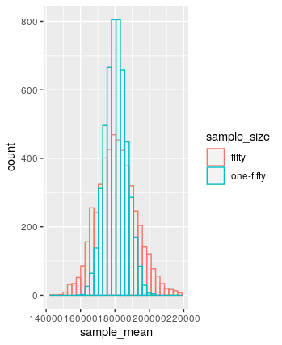

	To generate this plot, I ran the following. 

	~~~R
	> sample_mean = c(sample_means50, sample_means150)
	> sample_size = c(rep("fifty",5000), rep("one-fifty",5000))
	> frame = data.frame(sample_mean, sample_size)
	> ggplot(frame, aes(x=sample_mean, color=sample_size)) + geom_histogram(fill="white", alpha=0.1, position="identity")
	~~~
	
	Note: I apparently switched to using `ggplot` at this point when writing up solutions, just for fun. The students don't have to use `ggplot`. They might just include two separate plots, or they might just calculate standard deviations and compare them numerically. 

# Lab 6

1. Sample statistics (they certainly didn't talk to everyone in the world!). 

2. The study needs to have been a simple random sample. It's fairly unlikely that this is the case on the nose. A large portion of the global population is not easy to communicate with (living in remote locations, lack of access to communications technology, etc), but it seems that the study did try to minimize bias, so we can probably assume that the sample was "simple random" enough. 

    Note: Exact answers might differ from the above. This might be one of those questions where almost any (reasonable?) response will get full credit. 

3. Each row in Table 6 corresponds to a country. Each row in `atheist` corresponds to a person. 

4. Running `table(us12$response)` shows that 50 out of 1002 US respondents reported being an atheist. 50/1002 = 0.0499002, which is basically 5% up to minor rounding. 

5. We need the sample to be independent: as noted earlier in question 2, this is a bit unlikely, but maybe it's close enough. We also need the sample size to be large enough that the success-failure condition is satisfied. The success-failure condition requires checking that $1002 \cdot 0.05$ and $1002 \cdot 0.95$ are both bigger than 10, which is true. 

6. The margin of error is about 0.014. The 95% confidence interval is (0.0364 , 0.0634).

7. The 90% confidence interval is (0.03858586 ,  0.06121454). This interval is narrower. This makes sense because, to be more confident that our interval captures the true proportion, we'll need the interval to be wider. 

    Note: There was a typo in an earlier version of the lab where I wrote "2021" instead of "2012." There was no data for 2021 in this data frame, so students might have figured out the right thing, but feel free to be lenient if someone took the problem with the typo at face value. 

8. In India, 33 out of 1092 respondents reported being atheist, which is about 3%. The success-failure condition is satisfied (because both the atheist and non-atheist numbers are larger than 10), but it's likely that the sample isn't that great. The 95% confidence interval is (0.0201 , 0.0404), and the margin of error is about 0.0102. 

	In Japan, 372 out of 1212 respondents reported being atheist. Same comments about applicability of confidence interval methods. The 95% confidence interval is (0.281 , 0.3329), which has margin of error about 0.0259. 
	
	Note: Students might choose different countries here. 

9. The graph is shaped like the top half of an ellipse. 

    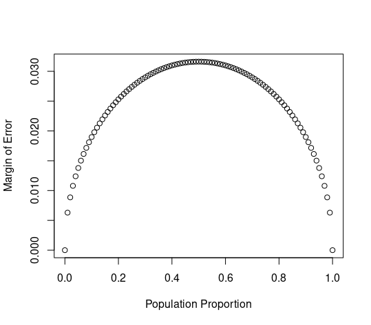
    
    Note: Students might say something like "semicircle" or "parabolic" or something, and that's okay too. 

10. The distribution is roughly normal, with mean at 0.09969. 

    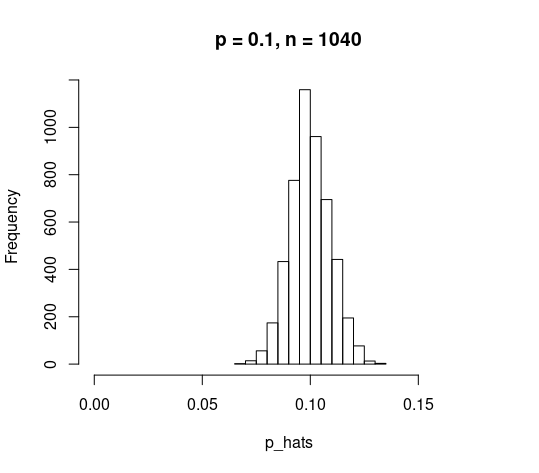
    
    Note: Randomness is involved here, so students' means might differ slightly. 

11. The plots are displayed below. Increasing $n$ seems to make the plot narrower. Changing $p$ seems to move the center of the plot. All four are roughly normal, except for the very last one which is a little cut off towards the bottom, making it right skewed. 

	

12. For Australia, we have $np \approx n\hat{p} = 1040 \cdot 0.1 = 104 \geq 10$ and $n(1-p) \approx n(1-\hat{p}) = 1040 \cdot 0.9 \geq 10$, so it is reasonable to proceed with inference. 

    For Ecuador, we have $np \approx n\hat{p} = 200 \cdot 0.02 = 4 < 10$, so it is not a great idea to proceed with inference on Ecuador's data. The sampling distribution is likely not normal in this case. 

13. For Spain, the success-failure condition is satisfied, though I have the same concerns about randomness of the sample that I've mentioned above. The 2005 confidence interval is (0.083 , 0.1177), and the 2012 confidence interval is (0.0734 , 0.1065). These overlap, so we do not have convincing evidence of chance.

    ```R
    es05 <- subset(atheism, nationality == "Spain" & year == "2005")
    es12 <- subset(atheism, nationality == "Spain" & year == "2012")
    proportion.ci(es05$response == "atheist")
    proportion.ci(es12$response == "atheist")
    ```

	In the US, the intervals are (0.0038 , 0.0161) and (0.0364, 0.0634), which do not overlap. This does provide some evidence of change. 
	
	```R
    us05 <- subset(atheism, nationality == "United States" & year == "2005")
    us12 <- subset(atheism, nationality == "United States" & year == "2012")
    proportion.ci(us05$response == "atheist")
    proportion.ci(us12$response == "atheist")
    ```

14. We'd expect to detect a change in 5% of the countries in which there has been no change. 

15. The point here is to look at the inequality $$2 \sqrt{\frac{p(1-p)}{n}} \leq 0.01$$ and solve it for $n$. Simplifying this gives $n \geq 40000p(1-p)$. The largest possible value of $p(1-p)$ happens when $p = 0.5$. When $p = 0.5$, we have $40000p(1-p) = 10000$. So we should sample at least 10000 people. 

# Lab 7

## Exercises

1. The distribution is right skewed. If "typical" size means mean, then the mean is 1445.53, though perhaps the median is a better estimate since the data is skewed. The median is 1407. 

	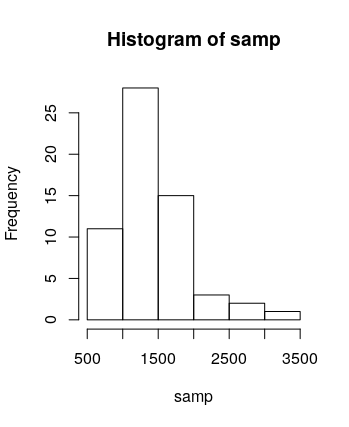
	
	Note: It's fine if they interpret "typical" to mean either mean or median. 

2. It should be similar, but not identical. Different people will have different samples of 60. 

3. The observations need to be independent and the sample size needs to be at least 30. 

4. "95% confidence interval" means that, 95% of the confidence intervals constructed in this way will contain the true mean. 

5. Yes, my confidence interval does contain the true mean. 

6. One would expect that 95% of confidence intervals constructed in this way will contain the true mean. 

7. 47/50 contain the true mean, which is about 94%. This is approximately equal to the confidence level, but not quite. This makes sense because we'd only expect 95% of confidence intervals to contain the true mean in the limit (eg, if we took 50000000 samples instead of just 50). 

	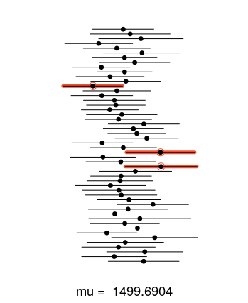

8. The critical value for 50% confidence interval can be calculated by `abs(qnorm(0.25))` or as `qnorm(0.75)`, both of which yield 0.674. 

    Note: Students might choose different confidence levels here, so their computation of the critical value will also be different. 

9. Constructing 50% confidence intervals (which are much narrower than 95% confidence intervals), 22 of them do not contain the true mean. Thus 27/50 = 54% of them do, which is pretty close. 

	
	
	To generate this, I ran the following: 
	
	```R
    lower_vector <- samp_mean - 0.674 * samp_sd / sqrt(n) 
    upper_vector <- samp_mean + 0.674 * samp_sd / sqrt(n)
    plot_ci(lower_vector, upper_vector, mean(population))
	```
	
	Note: Again, students might have chosen a different confidence level in the question above, so their answer here might be different. 

# Lab 7

1. Each observation is a birth. There are 1000 cases. 

2. The side-by-side box plot (a non-`ggplot` version of which can be created using `boxplot(nc$weight ~ nc$habit)`) is displayed below. It seems that babies born from mothers who smoke tend to weigh less, though there are more outlying weights on both ends for women who don't smoke. 

	

3. Each group has more than 30 observations (one has 126, the other has 873), so conditions for inference should be satisfied. 

4. Let $\mu_1$ be the average weight of babies born to mothers who smoke, and $\mu_2$ the average weight of babies born to mothers who don't smoke. Then $H_0$ is the statement that $\mu_1 - \mu_2 = 0$, while $H_A$ is the statement that $\mu_1 - \mu_2 \neq 0$. 

5. The $p$-value is 0.01945. This means that, if $H_0$ is true, there is a 1.95% chance of seeing data that's at least as favorable for $H_A$ as the data that we actually saw. 

6. The confidence interval for $\mu_1 - \mu_2$ is (-0.58, -0.05). 

7. The 95% confidence interval is (38.15, 38.52). 

	```R	
	t.test(nc$weeks)
	```

8. The 90% confidence interval is (38.18, 38.49).

   ```R
   t.test(nc$weeks, conf.level = 0.9)
   ```

9. The t-value is -1.38 with 175.45 degrees of freedom, and p-value 0.1704. This is not sufficient evidence to reject the null hypothesis that the average weight gained by the two groups is the same.

	~~~R
	t.test(nc$gained ~ nc$mature
	~~~ 

10. It seems that mothers 34 and under are classified as "younger" while those 35 and older are "mature." This can be checked by running either of the following. 

	~~~R
	max(subset(nc, mature == "younger mom")$mage)
	min(subset(nc, mature == "mature mom")$mage)
	~~~

11. Let $\mu_1$ be the average weight of babies born to younger moms and $\mu_2$ the average weight born to mature moms. Let $H_0$ be the hypothesis that these means are the same, and $H_A$ that they are different. A boxplot of the distributions is displayed below. Running a t-test gives us a p-value of 0.85, so we fail to reject the hypothesis that these two means are different. 

	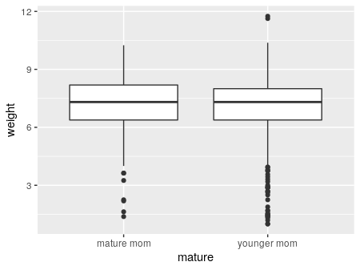

	~~~R
	ggplot(nc, aes(mature, weight)) + geom_boxplot()
	younger = subset(nc, mature=="younger mom")
	mature = subset(nc, mature=="mature mom")
	t.test(younger$weight, mature$weight)
	~~~

# Lab 9

1. We'd use a scatterplot. It's not a great linear relationship, but does look generally positive. It might be reasonable to use `at_bats` to predict `runs`, but we couldn't be very confident in our prediction. 

	

2. (More or less the same as exercise 1) There's an increasing relationship, but the linear fit doesn't appear to be very great. The Boston Red Sox observation, with more than 5700 `at_bats` is fairly unusual. The Yankees observation, with 5518 `at_bats` and 867 `runs` is also somewhat unusual. 

    Note: Students might not identify both of those "unusual" observations, but they should at least identify one. 

3. The equation is $y = 1.83x + 415.24$. The slope tells us that, for each additional `at_bat`, a team is expected to make 1.83 additional `runs`. 

	

	~~~R
	ggplot(mlb11, aes(homeruns, runs)) + geom_point() + geom_smooth(method="lm")
	m2 = lm(runs ~ homeruns, data = mlb11)
	summary(m2)
	~~~

4. The model would predict 728.32. The actual runs were 713, so the model overestimates. The residual is -15.32. 

5. There's not a clear pattern in the residuals. 

    

6. The residuals are sort of normal, but not very normal --- there seems to be a slight right skew in the histogram. 

    
    

7. The variability seems close to being constant. Perhaps it decreases slightly as `at_bats` increases. (See the plot from exercise 6 above)

8. The relationship between `runs` and `bat_avg` seems sort of linear. 

	
	
    Note: In this problem and the next, students have a choice about what variables they choose to analyze. You don't need to go through and check that their numbers are actually correct. Just make sure that they've answered everything and their interpretations are correct based on the numbers they've given. 

9. The $R^2$ is 0.65, compared to 0.37 for `runs` against `at_bats`, so the linear fit is better in this situation. 

10. `bat_avg` is the best predictor for `runs`. 

	~~~R
	> cor(mlb11$runs, mlb11$at_bats)^2
	[1] 0.3728654
	> cor(mlb11$runs, mlb11$hits)^2
	[1] 0.6419388
	> cor(mlb11$runs, mlb11$homeruns)^2
	[1] 0.6265636
	> cor(mlb11$runs, mlb11$bat_avg)^2
	[1] 0.6560771
	> cor(mlb11$runs, mlb11$strikeouts)^2
	[1] 0.1693579
	> cor(mlb11$runs, mlb11$stolen_bases)^2
	[1] 0.002913993
	> cor(mlb11$runs, mlb11$wins)^2
	[1] 0.3609712
	~~~

11. All of these new ones are better; the best is `new_obs`. 

	~~~R
	> cor(mlb11$runs, mlb11$new_onbase)^2
	[1] 0.8491053
	> cor(mlb11$runs, mlb11$new_slug)^2
	[1] 0.8968704
	> cor(mlb11$runs, mlb11$new_obs)^2
	[1] 0.9349271
	~~~

	 
	
12. There does appear to be no pattern in the residual plot, and the residuals are relatively normal (certainly more normal than they were for `at_bats`!). 

	
	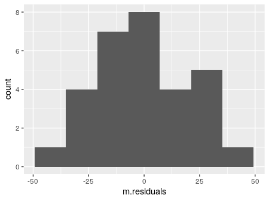
