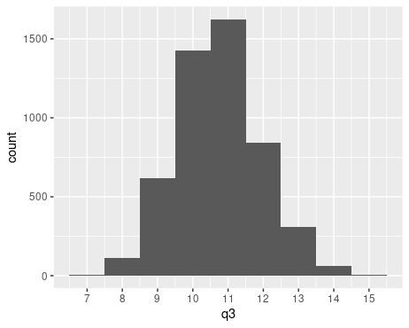
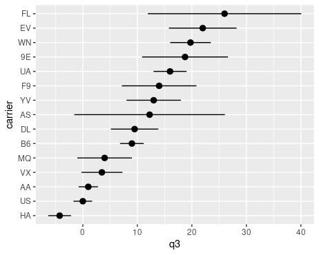

# Introduction to Bootstrapping

## Overview

Let us say loosely that an *aggregation function* is a function which takes as input some data and outputs a single number. For example, the function which takes as input data from a single numerical variable and outputs the mean (or median, or 25th percentile, or 53rd percentile, or standard deviation) is an aggregation function. The function which takes as input data from a single binary variable and outputs the percentage of `TRUE` values is also an aggregation function. We can also have aggregation functions which take as input data from multiple variables. For example, you might be interested in the function which takes as input data from two numerical variables, and outputs the slope of the least squares regression line. As is probably clear, almost anything can be considered an aggregation function.[^agg]

[^agg]: Technically, an aggregation function should be a real-valued function on the space of distributions which satisfies some very technical properties (eg, Hadamard differentiability). Don't worry about all of this. 

Suppose I fix an aggregation function. If I were able to evaluate the aggregation function on data from the entire population, the output would be called a *population parameter*. Of course, in many situations of interest, we do not have population data. Instead, we merely have data from a random sample. The output of the aggregation function on this data from a random sample is called a *sample statistic* (sometimes also called a *point estimate*). 

When we calculate a sample statistic, it's often a good idea to try to understand how "uncertain" we should be about its value. How far might the value of the population parameter be? How different might the sample statistic have been if we had chosen a different random sample? 

These questions can be formalized precisely using mathematics. There is probability space which lists off all of the possible random samples of a given size. The aggregation function can then be regarded as a random variable on this probability space. The "uncertainty of the sample statistic" is then formalized by asking: what is the distribution of this random variable? This  distribution is called the *sampling distribution* of the statistic. 

We can sometimes derive what the sampling distribution looks like on the nose, but only in somewhat special situations. *Bootstrapping* is a widely applicable strategy for approximating the sampling distribution of a test statistic, no matter what aggregation function we might be  interested in. 

The idea is that we repeatedly *resample with replacement* from our random sample, evaluate the aggregation function from each of those resamples, and build a distribution of the outputs. The result of this process is called the *bootstrap distribution*. 

Difficult mathematics guarantees that, for almost any aggregation function and almost any population distribution, the bootstrap distribution you get from your sample will be a good stand-in for the sampling distribution (at least as long as your sample was "large enough," where the precise definition of "large enough" depends on what aggregation function you're dealing with). Thankfully, while it may be difficult to prove this, it's not at all difficult to apply this idea in practice!

## Extended Example




### Introduction

Suppose I'm interested in the 75th percentile (ie, third quartile) of departure delays of flights out of NYC, and that I collect a random sample of data from {{ sample_size }} flights to figure out what the 75th percentile might be. 

Let me simulate this by taking a random sample of {{ sample_size }} flights from the `nycflights13::flights` data set. 

```R
library(tidyverse)
library(nycflights13)

sample_size = {{ sample_size }}
sample <- flights %>% slice_sample(n = sample_size)
```

I'm now going to forget about the `flights` tibble and pretend like `sample` is the only data I have access to (except for a brief interlude below). The R function `quantile` is useful for calculating percentiles. The following outputs the 75th percentile of the `dep_delay` column of `samples`: 

```R
quantile(sample$dep_delay, prob = 0.75, names = FALSE, na.rm = TRUE)
```

For me, this outputs 10, but you might get something else since your random sample will be different. This means that 75% of flights in my sample have a departure delay of less than 10 minutes from their scheduled departure time. 

Since the call to `quantile(...)` above involves a lot of typing, let's save ourselves some typing by defining a new function, called `q3`, which does the same thing:

```R
q3 <- function(x) {
  quantile(x, prob = 0.75, na.rm = TRUE, names = FALSE)
}
```

Running `q3(sample$dep_delay)` still outputs 10 (for me), as it should! It's still the same sample, after all. Check that you still get the same output. 

The function `q3` is the relevant aggregation function in this extended example. When you bootstrap in other settings, you'll have to swap out `q3` for whatever other aggregation function you might be interested in.

Now I might want to understand how uncertain I ought to be about this 10 number that I calculated. 

## Interlude: Let's Stop Pretending

For a moment, let's stop pretending that we don't have access to the full `flights` data set. I can use this full data set to calculate the true 75th percentile (ie, the population parameter): 

```R
q3(flights$dep_delay)
```

It turns out to be 11, so the statistic I calculated from my sample wasn't too far off. 

I can also calculate the true sampling distribution by repeatedly sampling from the full data set. Here's how to do this. (Don't worry too much about how this piece of code works right now. We'll discuss the important parts below, and then if you like, you can come back to this code and figure out what it's doing.)

```R
library(modelr)

repetitions = {{ repetitions }}

index_lists <- map(seq(repetitions), ~ sample(seq(nrow(flights)), sample_size))
samples <- map(index_lists, ~ resample(flights, .))

samples <- tibble(sample = samples, .id =  seq(repetitions)) %>% 
  mutate(q3 = map_dbl(sample, ~ q3(as_tibble(.)$dep_delay)))
  
samples %>% 
    ggplot(aes(q3)) + 
    geom_histogram(binwidth = 1) + 
    scale_x_continuous(breaks = 5:16)
```

The output shows us roughly what the true sampling distribution looks like. 



This gives us some indication for how uncertain to be about our statistic. It shows us, for example, that, though 11 is the most common 75th percentile that one might obtain from a random sample of size {{ sample_size }}, a sample whose 75th percentile is 10 (like the sample that I got) is not so uncommon. 

<!--
If you'd like to extract a number that measures this uncertainty, you can calculate the  *standard error*, ie, the standard deviation of the sampling distribution: 

```R
sd(samples$q3)
```

I get about 1.21 when I do this. A loose way of  interpretting this is as specifying a kind of range around the population parameter: *most* samples of size {{ sample_size }} taken from `flights` will have a 75th percentile that's within 1.21 minutes of the true parameter value (ie, of 11 minutes). Since my sample's 75th percentile was in fact within 1.21 minutes of the parameter value, my sample wasn't too unusual. 

Standard error isn't the only number you can extract from the sampling distribution, but it is a relatively straightforward one. There are many others of varying degrees of complexity. -->

When the sampling distribution is roughly symmetric and centered about the true population parameter (as it is above), the aggregation function is said to be "unbiased." There are various ways of making this a precise mathematical definition which aren't worth dwelling on here, but most aggregation functions that one uses in practice are unbiased according to at least one of these definitions of unbiased. It's possible to deal with biased aggregation functions, but things get a little more complicated. 

Let's now go back to pretending that we don't have access to the `flights` data set. In real life, we won't often have access to population data (and even if we do, constructing a sampling distribution from the population data would be a somewhat academic exercise). There's now know way of knowing that the parameter value is actually 11, or of knowing what the sampling distribution looks like, or of knowing the standard error. 

But we *can* calculate the bootstrap distribution, which is an approximation for the sampling distribution. To do this, we'll repeatedly take resamples of size {{ sample_size }} with replacement from `sample`, and then compute the 75th percentile of each of those resamples. Note that it's important that the resamples are chosen *with replacement*. If we were to choose a sample of size {{ sample_size }} from `sample` *without* replacement, the result will always just be all of `sample`, since `sample` has {{ sample_size }} elements!

## Resamples

The `modelr` package provides some useful tools for resampling. It's a `tidyverse` package, but isn't loaded in by default with the `library(tidyverse)` command, so you should load it in now. (You might already have done this if you copied the previous chunk of code into the console, but there's no harm in doing it again.)    

```R
library(modelr)
```

To understand resamples, let's take a single resample with replacement from `sample` of the same size as `sample`. The function `resample_bootstrap` does exactly this:  

```R
resample <- resample_bootstrap(sample)
```

This generates an object of type "resample," which is sort of like a tibble --- except it's not. To save space in memory,  it's actually just a list of pointers to rows in `sample`. To turn it into an actual tibble, you have to use the function `as_tibble`: 

```R
as_tibble(resample)
```

Now if I want to compute the 75th percentile of departure delays from this resample, I'd can do this: 

```R
q3(as_tibble(resample)$dep_delay)
```

Or, if you're really into pipes, you could  equivalently do this: 

```R
resample %>%
    as_tibble() %>%
    pull(dep_delay) %>%
    q3()
```

## Bootstrapping

To bootstrap, we're going to take {{ repetitions }} resamples. Note that the number {{ repetitions }} is arbitrary; feel free to choose any big number when you're bootstrapping. The bigger the better, but of course computations will get slower with bigger numbers.  

The `bootstrap` function from `modelr` repeatedly performs `resample_bootstrap`, as many times as you specify, and stores the results of each resample in a row in a tibble. 

```R
library(modelr)
repetitions <- {{ repetitions }}
resamples <- bootstrap(sample, repetitions)
```

The result of this is a tibble named `resamples` with {{ repetitions }} rows, each corresponding to one resample. There are two columns: one named `strap` which contains the actual `resample` object, and one named `.id` which assigns a number to each resample. 

We're now going to add a column named `q3` to `resamples`. This column will record the 75th percentiles of all of the resamples. 

```R
resamples <- resamples %>% 
    mutate(q3 = map_dbl(strap, ~ q3(as_tibble(.)$dep_delay)))
```

What's going on here? The function `map_dbl` takes as input a list and outputs a list of `dbl`s (ie, decimal numbers). The list it takes as input is specified by the first argument to `map_dbl` --- in this case, the `strap` column of `resamples`, which is a list of objects of type "resample." It then applies the function that follows the `~` to each object in the input list, substituting that object in place of the `.` that shows up in the expression. This gives us a list of doubles (each double being the 75th percentile of departure delays of each resample), and we assign that list of doubles to be a column named `q3` in the `resamples` tibble. 

Note `q3` is now both a function as well as a column in `resamples`. Make sure you know which one is being talked about whenever you type `q3` from here on out.

You can now make a histogram of these 75th percentiles to see the bootstrap distribution. 

```R
resamples %>%
    ggplot(aes(q3)) + 
    geom_histogram(binwidth = 1) + 
    scale_x_continuous(breaks = 5:16)
```

You should now see a distribution that isn't *too* different from the sampling distribution that we made during the interlude, but instead of being centered around 11, it'll probably be centered around whatever you got for `q3(sample$dep_delay)`. Here's what I see: 


## Standard Error

Once you have a bootstrap distribution, you can extract quantitative measures of uncertainty from it. The easiest of these is the standard error. 

By definition, *standard error* is the standard deviation of the sampling distribution. We don't know what the sampling distribution is (or rather, we're pretending we don't...), so a good stand-in is the standard deviation of the bootstrap distribution. We can calculate this as follows: 

```R
sd(resamples$q3)
```

I get 1.52, but you might get something a little different since your `sample` and `resamples` will be different from mine. 

A loose way to interpret this 1.52 value is as specifying some kind of range around the statistic. It's saying roughly that the it would not be too surprising if the true parameter value was within 1.52 units of the sample statistic that I obtained from my sample. 

We saw during the interlude that the parameter value was 11 -- which is in fact within 1.52 minutes of my sample statistic. Is the parameter value within the range specified by the standard error of your sample statistic? (It might not be, and that's okay.)

## Required Exercise 

Using your `sample` and your bootstrap `resamples`, generate a plot like this: 



The points in this plot mark off the 75th percentile of the departure delays of each carrier, and the lines extend from the 75th percentile minus the standard error to the 75th percentile plus the standard error. The carriers on the y-axis are sorted by the 75th percentile of their departure delays. 

Note that, depending on the `sample` you're working with, your plot might look radically different from the one above: the ordering of carriers could be very different, some carriers might have huge standard errors, some carriers might just be points without intervals, etc. Remember at the end of the introduction where we said "if the same size is 'large enough'"? The issue here is that a sample of size {{ sample_size }} is not really big enough for this particular calculation to be stable. It's big enough for the standard error calculation for the 75th percentile of *all* flights to be relatively stable, but after grouping into categories based on carrier, some of the groups have too small a sample --- especially the groups corresponding to carriers that have very few flights represented in the `flights` data set. 

So, after you get your code working with your original `sample` of size {{ sample_size }}, take a new larger `sample` of size {{ sample_size | times: 10 }} from `flights`. Filter out the carriers which have very few observations. Build a bootstrap distribution using your filtered sample, and then use this bootstrap to generate the same kind of plot as the one above.

This exercise might be a little challenging. It may be helpful to review the `dplyr` functions `group_by` and `summarize`, and to browse the `dplyr` and `tidyr` [cheatsheets](https://www.rstudio.com/resources/cheatsheets/) for other helpful functions.   

For the purposes of grading, we'll pretend that this exercise belongs to [WNP21, Section 5.1] (which has no associated exercises). In other words, you should do this exercise as a part of assignment [F](../assignments#F). 

## Confidence Intervals

Another quantitative measure of uncertainty that can be extracted from a bootstrap distribution is a *confidence interval*. There are several different types of bootstrapped confidence intervals. Here, we just focus on one simple type. 

The confidence interval of confidence level $\gamma$ goes from the $((1-\gamma)/2)$th percentile of the bootstrap distribution up to the $(1-(1-\gamma)/2)$th percentile. For example, if $\gamma = 0.9$, we have $(1-\gamma)/2 = 0.05$ and the 90% confidence interval goes from the 5th to the 95th percentile of the bootstrap distribution. Recall that the bootstrap distribution is stored in `resamples$q3`, and we can use the `quantile` function to calculate its percentiles. In fact, we can calculate both in one go: 

```R
quantile(resamples$q3, probs = c(0.05,0.95), names = FALSE) 
```

For me, this outputs a 5th percentile of 8 and a 95th percentile of 12. I interpret this confidence interval by saying that I am 90% confident that the true 75th percentile of departure delays is between 8 and 12. 

As I know from the interlude, the true value (ie, 11) is in fact in this range. Does your 90%  confidence interval contain the true value? Even before you've done it, I know that there's a 90% chance that it will. (If it doesn't, that's okay! After all, there is a 10% chance that it won't.)

## Optional Exercises

Here are some more exercises that you might choose to do as a part of assignment [F](../assignments#F) to get to the 10 problem total. 

1. Calculate 80%, 95%, and 99% confidence intervals for the 75th percentile of departure delays from your bootstrap distribution. 

2. Change the plot from the [required exercise](#required-exercise) so that the lines display 90% confidence intervals (instead of the standard error). In other words, the line segments should stretch from the lower endpoint of the 90% confidence interval to the upper endpoint. 

3. Here's how you'd use `geom_density` to display the bootstrap distribution: 

    ```R
    resamples %>%
        ggplot(aes(q3)) + 
        geom_density()
    ```
    
    You'll probably notice something strange when you do this. Try replacing `geom_density()` with `geom_density(adjust = 1/2)` or `geom_density(adjust = 2)` or `geom_density(adjust = 4)`, and so forth, until you see something that looks reasonable. Once you've found something that seems reasonable, what are your opinions about using `geom_density` instead of `geom_histogram` to visualize the bootstrap distribution? Explain. 
    
4. Go back to the code in the interlude that generated the picture of the sampling distribution, and explain how it works. 

5. Read this [addendum about `rsample`](rsample). Then explain what would need to change with the code from the interlude that generated the picture of the sampling distribution if you wanted to use `rsample` instead of `modelr`. 


