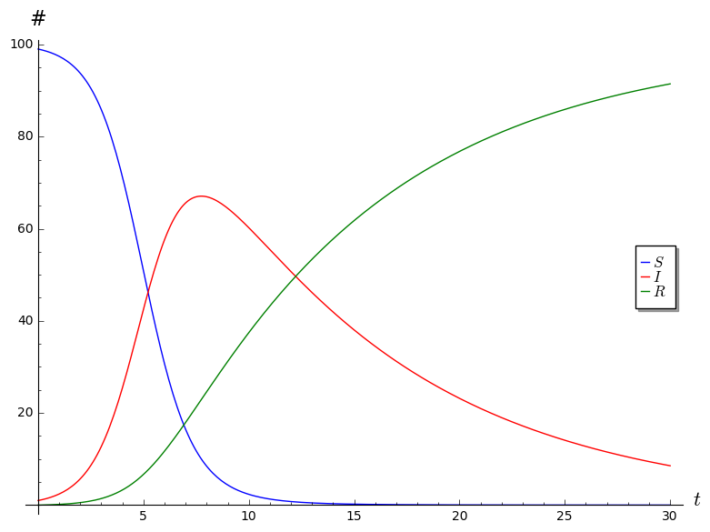
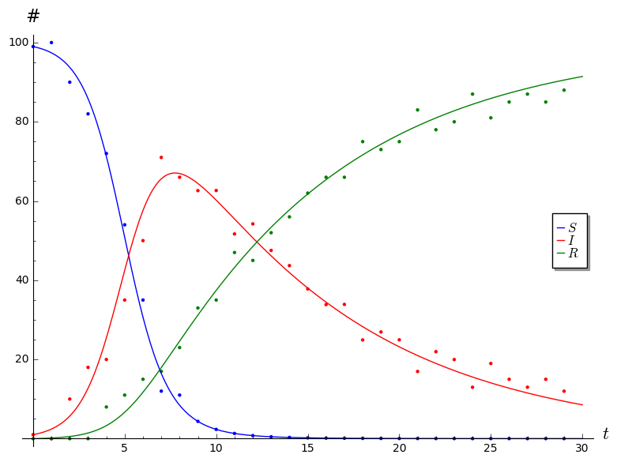

# SIR Project

This project[^reference] asks you to explore an ODE model that is used in epidemiology. The output of this project is a report. You're strongly encouraged to discuss with each other, but you should write up your report individually in your own words. One part of the project will involve generating some data in groups; your analysis should still be written up individually.

[^reference]: This project is adapted from the SIR project described by Stanley Florkowski and Ryan Miller on [SIMIODE](https://www.simiode.org/resources/4796/download/6-018-S-ExploringSIRModel-StudentVersion.pdf?b192279d45ce41a0fded95960ba3c998=1), and from ideas I got from conversations with Andrea Bruder.

Email me your report as a PDF by 11:59pm on 3rd Monday.

## Introduction

A *compartmental model* in epidemiology is one that divides the population into various groups (or compartments) in order to model the spread of an infection. The SIR model is an important example of a compartment model; it uses a nonlinear system of ODEs to model the spread of a non-fatal infection through a population. It derives its name from the names of the three groups that it divides the population into:

1. The people that are <strong>S</strong>usceptible to catching the disease but are currently uninfected.
2. The people that are currently <strong>I</strong>nfected.
3. The people that are immune to the disease, either inherently, or because they have <strong>R</strong>ecovered from the infection and have now developed immunity.

Let $t$ denote the number of days that have elapsed since the infection begins to spread; we let $S(t)$, $I(t)$, and $R(t)$ be the number of people in each of the above categories on day $t$. The model makes several simplifying assumptions and uses it to derive a system of ODEs satisfied by the functions $S$, $I$, and $R$.

1. The total population $$N = S(t) + I(t) + R(t)$$ is always constant. In other words, this model makes the most sense for infections that spread in relatively short periods of time (much shorter than the life span of a human being) and do not kill off those who get infected.

2. Each infected person infects a fixed fraction, $b$, of susceptible people every day. In other words, each infected person causes $bS(t)$ new infections on day $t$, so $dS/dt = -bSI$.

3. A fixed fraction, $c$, of infected individuals recover every day. In other words, $dR/dt = cI$.

Putting the above assumptions together, we find $dI/dt = bSI - cI$. In other words, the SIR model asserts that the functions $S$, $I$, and $R$ satisfy the following system of ODEs.
$$\begin{aligned}
\frac{dS}{dt} &= -bSI \\
\frac{dI}{dt} &= bSI - cI \\
\frac{dR}{dt} &= cI
\end{aligned}$$

## Part 1

Answer the following questions.

1. Why does it make sense for $dS/dt$ to be negative and $dR/dt$ to be positive?
2. What real world constraints does our model impose on the parameters $b$ and $c$?
3. Explain how one derives the equation for $dI/dt$ from the other three equations.
4. What terms make this system of ODEs nonlinear?
5. Use your intuition and guess what should happen to $S(t), I(t)$ and $R(t)$ as $t \to \infty$.
6. Explain why, if $S(0) < c/b$, then $I$ is monotonically decreasing. (In other words, if $c/b$ is large, the infection doesn't spread.)
7. Describe a real world interpretation of the ratio $c/b$.

## Interlude

Parts 2 and 3 will ask you to do some numerical calculations using a computer. If you are already comfortable with some programming language that can do numerical calculations with systems of ODEs, I encourage you to use that it. This should be possible with most high-level mathematical programming software (Sage, R, Octave/MATLAB, Maple, Mathematica...), and there are probably libraries that will do this for lower-level programming languages (C, Java...).

If you don't have one you're comfortable with yet, I suggest familiarizing yourself with one of the open-source ones. You do have access to licenses to some proprietary software through CC, but you won't after you graduate. My suggestion is [SageMath](https://www.sagemath.org/).

Here is some Sage code that will generate plots of $S$, $I$ and $R$ for $t = 0$ through $t = 30$ using the parameters $b = 0.01$, $c = 0.1$, and $N = 100$, and the initial conditions $I(0) = 1$, $R(0) = 0$, and $$S(0) = N - (I(0) + R(0)) = 99.$$

~~~Python
# Parameters
b = 0.01
c = 0.1
N = 100

# Initial conditions
I_0 = 1
R_0 = 0
S_0 = N - (I_0 + R_0)

# Endpoint time
T = 30

# Step size (the smaller this number, the more accurate the solutions, but the more time the computation will take)
s = 0.1

# Solve system numerically
S, I, R, t = var('S, I, R, t')
P = desolve_system_rk4([-b*S*I, b*S*I - c*I, c*I], [S, I, R], ivar=t, ics=[0, S_0, I_0, R_0], step=s, end_points=T)
Ss = [ [i,j] for i, j, k, l in P]
Is = [ [i,k] for i, j, k, l in P]
Rs = [ [i,l] for i, j, k, l in P]

# Generate plots
plot = list_plot(Ss, color="blue", plotjoined=True, legend_label='$S$', axes_labels=['$t$','#']) + list_plot(Is, color="red", legend_label='$I$', plotjoined=True) + list_plot(Rs,  color="green", legend_label='$R$', plotjoined=True)

# Show plot
plot.show()

# To save your plot, use plot.save("location/of/file/to/save/to.png")
~~~

I encourage you to toy around with the code until you've figured out what's going on. It may be worth pointing out that the object <code>Ss</code> is a list consisting of pairs $[t, S(t)]$, and similarly with <code>Is</code> and <code>Rs</code>. The output of the above code is the following plot.

## Part 2

Colorado Springs has a population of about 500,000. Suppose that initially just 1 person contracts an infection that's very contagious, but not very deadly. No one is immune initially, but people develop immunity after they've recovered from the infection. Each infected person infects 0.0005% of the susceptible population every day, and 40% of the infected population recovers every day.  

1. What values of the parameters $b$ and $c$ are suggested by the above description? What initial conditions $S(0)$, $I(0)$, and $R(0)$ are suggested?
2. Generate a plot showing how $S$, $I$, and $R$ vary with time until day 40. Be sure your plot is clearly labeled.
3. On what day is the infected population the highest?

Now assume that 40% of the population is inherently immune to this infection.

4. How do the initial conditions and/or parameters change under this assumption?
5. Generate a plot showing how $S$, $I$, and $R$ vary with time.
6. At what point is over 90% of the population immune to the infection?

## Part 3

For this part, you'll generate some data modeling the spread of a zombie virus in groups of 3-4 using some markers and hex grid transparencies, and then fit an SIR model to the data you collect from your simulation. I'll explain the details of how the mechanics of simulation will go in class.

In a small town of 50 inhabitants, 1 person has been infected by a zombie virus. As a group, decide on some infection rules, recovery rules, and movement rules. How close does a human have to be to be infected by a zombie? How many humans or cells can one zombie infect in a single time step? How many cells can a human move in a single time step? How many cells can a zombie move in a single time step? How do you deal with the edge of the grid? Are any of the humans immune from zombiehood from the outset? Under what conditions does a zombie recover and become immune from zombiehood?

You should assume that humans and zombies do not reproduce or die, so that the total population is always 50, but aside from that, feel free to decide on rules however you like, and to clearly record all of the rules you're using to generate your data.

Then run the simulation and generate your data. Use a spreadsheet to record your data in a table that looks something like the following. Or just use a plain text CSV file. Keep running your simulation until either it is clear to you that nothing is going to change, or until you hit time step 40.

<table style="display: block; margin: auto; width=80%">
<tr>
<th>$t$</th>
<th>$S(t)$</th>
<th>$I(t)$</th>
<th>$R(t)$</th>
</tr>

<tr>
<td>0</td>
<td>?</td>
<td>1</td>
<td>?</td>
</tr>

<tr>
<td>1</td>
<td>?</td>
<td>?</td>
<td>?</td>
</tr>
</table>

Once you have your data, your job is to find the parameters $b$ and $c$ that fit your data well, and to generate a plot that looks something like the following (where the points represent the data that you actually collected from the simulation, and the curves are the solutions generated by the SIR model).

You can do this by guessing and checking various values of the parameters $b$ and $c$ until you find something that works reasonably well. For an optional challenge, try to figure out a way to find optimal[^optimal] values for the parameters :)

[^optimal]: There are probably many ways of defining "optimal," and even with a fixed definition of "optimal," there are many ways of finding those optimal parameters. You'll have to figure out both of these things if you decide to do this challenge. If you'd like some possible hints, come talk to me!

Note that I artificially concocted the simulation data displayed in the above plot precisely so that the ODE model fits the data reasonably well. Your model might not fit your data as well, and that's perfectly okay. Share the plot using the best values of $b$ and $c$ you can find, and then answer the following questions.

1. What values did you use for the parameters?
2. Are there particular regions where the model seems to fit your data well? Are there particular regions where it doesn't fit very well?
3. If you couldn't find any set of parameters that fit well, can you explain why? Was there something about the rules for infection/movement/recovery you decided on for the simulation that broke down the assumptions of the SIR model?

If you're using Sage and you have a CSV file containing your data, you should be able to use something like the following to generate these kinds of plots.

~~~Python
import csv
file = '/location/of/data/file.csv'

# Parameters
b = 0.01
c = 0.1
N = 100

# Initial conditions
I_0 = 1
R_0 = 0
S_0 = N - (I_0 + R_0)

# Endpoint time
T = 30

# Step size
s = 0.1

# Solve system numerically
S, I, R, t = var('S, I, R, t')
P = desolve_system_rk4([-b*S*I, b*S*I - c*I, c*I], [S, I, R], ivar=t, ics=[0, S_0, I_0, R_0], step=s, end_points=T)
Ss = [ [i,j] for i, j, k, l in P]
Is = [ [i,k] for i, j, k, l in P]
Rs = [ [i,l] for i, j, k, l in P]

# Get data from file
reader = csv.reader(open(file))
data = []
for row in reader:
    i, j, k, l = row
    data.append([float(i), float(j), float(k), float(l)])
Sdata = [ [i,j] for i, j, k, l in data]
Idata = [ [i,k] for i, j, k, l in data]
Rdata = [ [i,l] for i, j, k, l in data]

# Make plot
plot = list_plot(Ss, color="blue", plotjoined=True, legend_label='$S$', axes_labels=['$t$','#']) + list_plot(Is, color="red", legend_label='$I$', plotjoined=True) + list_plot(Rs,  color="green", legend_label='$R$', plotjoined=True)
plot += list_plot(Sdata, color="blue") + list_plot(Idata, color="red") + list_plot(Rdata,  color="green")
plot.show()
~~~

## Part 4

Describe another scenario, besides the spread of an infection, that could reasonably be modeled using the SIR system of ODEs: $$\begin{aligned}
\frac{dS}{dt} &= -bSI \\
\frac{dI}{dt} &= bSI - cI \\
\frac{dR}{dt} &= cI
\end{aligned}$$
Be sure to explain precisely what $S$, $I$, and $R$ stand for in your model. What units do they have? What real world interpretation do the parameters $b$ and $c$ have? What simplifying assumptions about the scenario make this system of ODEs appropriate?
