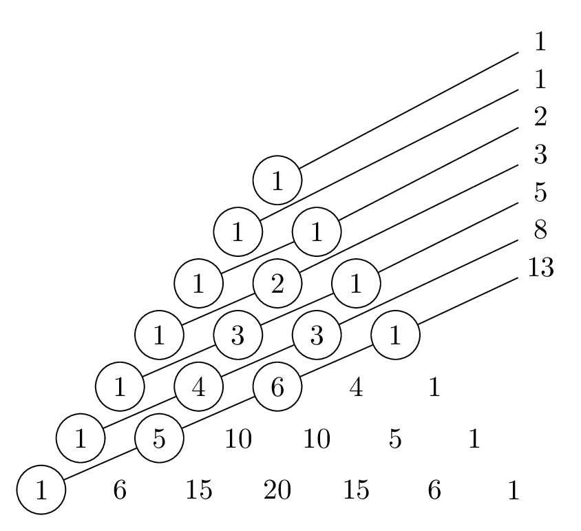

# Problem Sets

See instructions on the [syllabus](syllabus#problem-sets). Draft and final deadlines for each problem set are indicated on the [calendar](index#calendar). Submissions are all through Gradescope. 

There are two special types of problems: 

* Problems labelled "Challenging" might be harder than the others (or they might not be, and I just went about them in a harder-than-necessary way!). A thorough solution to these problems will earn you 1 additional point on top of whatever you would otherwise have gotten on that problem. 
* Problems labelled "programming" might require you to write some code. Feel free to write your code in whatever programming language you like. Note, though, that these problems will still require some mathematical forethought. In your TeX document, tell me the answer you got, describe how your code works, and explain why your code works. Submit your TeX document through Gradescope as usual, and then email me a well-commented plaintext file containing the code you wrote (`.py`, `.sage`, `.R`, `.hs`, etc). 

## Problem Set A {#A}

1. Let $T$ be the set of equilateral triangles with integer side lengths. Let $T_1$ be the subset of $T$ consisting of triangles with even side lengths, and let $T_2$ be the subset of $T$ consisting of triangles with even perimeter. Is it true that $T_1 = T_2$? If so, prove it. If not, give an explicit example of a triangle that is in one of the sets but not the other. 

2. It is a fact that $(1+a)^n \geq 1+na$ for any real number $a \geq 0$ and any integer $n \geq 0$. Give two proofs of this fact: one using induction on $n$, and another using the binomial theorem. 

3. The Fibonnacci numbers $F_1, F_2, F_3, \dotsc$ are defined by declaring $F_1 = F_2 = 1$ and then recursively defining $F_{n+2} = F_{n+1} + F_n$. For example: $$ \begin{aligned} 
F_3 &= F_2 + F_1 = 1 + 1 = 2 \\
F_4 &= F_3 + F_2 = 2 + 1 = 3 \\
F_5 &= F_4 + F_3 = 3 + 2 = 5 \\
&\;\,\vdots \end{aligned} $$ Prove that $F_1^2 + \dotsb + F_n^2 = F_nF_{n+1}$ for all $n \geq 1$. 

4. Suppose that the post office only issued 3-cent stamps and 7-cent stamps. Give an *explicit* description of the set of all postage amounts that can be created using stamps of these two types. Prove that your description is correct. 

    *Possible hint*. Start by working out some examples to see what amounts are possible. Is 1 cent possible? No. Is 2 cents possible? No. Keep going like this until you find a pattern, and then prove that your pattern holds forever. 

5. Prove that, for any integer $n \geq 1$, the binomial coefficient $\binom{2n}{n}$ is even.

    *Possible hint*. If it's possible to do this using induction, I don't know how. The argument I have in mind is not inductive. But if you're able to figure out an inductive argument, I'll be very happy to see it! 
    
6. (Programming, Challenging) A mysterious order of technomonks has developed an arcane alphabet with 13 letters. They believe that all of the names of God are enumerated by strings of lengths 1 through 13 in this alphabet, except those strings in which a single letter occurs more than 3 times in succession. When all of the names of God have been listed, they believe that the universe will blink out of existence. To bring about this eschatological end, they've written a computer program that will print out exactly one name of God every second. In how many years will the universe blink out of existence?[^clarke]

    [^clarke]: The premise of this problem is based loosely on Arthur C. Clarke's short story, "The Nine Billion Names of God." But, in this problem, there might not be nine billion names... ☺
    
7. (Challenging) Observe that the sums of the numbers in the diagonals of Pascal's triangle depicted below are Fibonacci numbers. 
    
    

      
    [[TeX Source](pascal-diagonals.tex)]
    

    Prove that this pattern continues forever. 

## Problem Set B {#B}

1. There are 63 piles of bananas with $n$ bananas each, and 7 additional bananas. All of these bananas are divided evenly among 23 travelers. How many bananas can be in each pile? (Describe the set of all possible values of $n$.)

    *Note*. This is a slight variant on a problem posed by the ninth-century mathematician [Mahāvīra](https://en.wikipedia.org/wiki/Mah%C4%81v%C4%ABra_(mathematician)). 

2. Prove that $n!+1$ and $(n+1)!+1$ are relatively prime for any integer $n \geq 1$. 

3. Prove that $$ \frac{\gcd(m,n)}{n} \binom{n}{m} $$ is an integer for all integers $n \geq m \geq 1$.

    *Possible hint*. Write $\gcd(m,n)$ as a linear combination of $m$ and $n$. 

4. Loki has acquired a well-earned reputation as a mischief-maker among the gods of Asgard. One day, Loki steals the goddess Iðunn's apples of eternal youth. With a wide grin on his face, he tells Iðunn that he's thinking of a perfect square which has remainder 3 when divided by 7, and if she tells him what number he's thinking of, he'll return her apples. Iðunn thinks about this for a few minutes, and then says "..." Loki glumly returns her apples. What did Iðunn say?

5. Define a sequence of integers recursively by declaring $S_1 = 1$, $S_2 = 2$, and $$ S_{n+2} = 2S_{n+1} + S_n $$ for all $n \geq 1$. How many divisions must the Euclidean algorithm perform when computing $\gcd(S_{n+1}, S_n)$ before it finds a remainder of 0? What is this gcd? How would your answers to these questions change if the initial conditions used to define the sequence were $S_1 = 14$ and $S_2 = 49$ instead?

6. Recall the definition of the triangular numbers $t_n$ from section 2.1, problem 1. Give an explicit description of the set of all positive integers $n$ such that $n \mid (t_1 + \dotsb + t_n)$. 

    *Possible hint*. You may find it helpful to use results you've proved on comprehension checks. If you do this, make sure to TeX up your proofs to these results as a part of your solution to this problem. 
    
7. (Programming?) Qwmqwm is a mathematicalien. Whenever she chooses a favorite number $n$, her body reconfigures itself so that it has $T(n)$ tentacles, where $$ T(n) = \sum_{k = 1}^{n-1} \gcd(n+k,n-k). $$ Qwmqwm has just chosen her favorite number to be 7568640000000083, which happens to be prime. How many tentacles does she now have? 

    *Note*. This problem can be done without programming. It might just take you a little bit longer to notice a pattern by hand. 

8. Submit a solution to a problem from any previous problem set that you haven't gotten any points for so far. 

## Problem Set C {#C}

1. (Ancient Chinese Problem) A band of 17 pirates stole a sack of gold coins. When they tried to divide the fortune into equal portions, 3 coins remainded. In the ensuing brawl over who should get the extra coins, one pirate was killed. The wealth was redistributed, but this time an equal division left 10 coins. Again an argument developed in which another pirate was killed. But now the total fortune was evenly distributed among the survivors. What was the least number of coins that could have been stolen?

2. Calculate the remainder when $76^{76^{76}}$ is divided by 7. Justify your answer.

    *Warning*. $76^{76^{76}}$ means `76^(76^76)`, not `(76^76)^76`. Those are different numbers! 
    
    *Note*. The number $76^{76^{76}}$ is monstrously large! Its binary representation would have roughly $10^{143}$ digits. Estimates for the [number of protons in the observable universe](https://en.wikipedia.org/wiki/Eddington_number) run around $10^{80}$. In other words, no computer known to humans has even *remotely* enough room to explicitly represent a number like $76^{76^{76}}$. Don't bother trying to compute this number!
    
3. Prove that an integer is a perfect square if and only if its square root is rational.

    *Possible hint*. If the square root of an integer is written as a fraction, show by contradiction that the denominator of that fraction cannot have any prime divisors. Also note that this is an "if and only if" statement, so make sure you address both directions (even if there's  not much to say for one direction!). 
    
4. Suppose $p_1, p_2, \dotsc, p_d$ are distinct primes. Show that $$\frac{1}{p_1} + \frac{1}{p_2} + \dotsb + \frac{1}{p_d}$$ is never an integer. 

5. If $n > 4$ is composite, show that $(n-1)! \equiv 0 \pmod{n}$. 

    *Note*. This result is not true for $n = 4$, so make sure your proof uses the fact that $n > 4$ at some point.
    
6. You have just discovered the ruins of a medieval monastery which has been uninhabited for centuries. One room of the monastery is locked by an 8-digit combination lock. As you continue exploring, you discover the diary of a monk who seems to love numbers written in Latin. This monk writes: 

    > Numerus perfectissimus inveni! Is est quadratus perfectus et divisibilis per 2, 3, 4, 5, 6, 7, 8, 9, 10, 11, et 12.[^latin]

    [^latin]: I don't know Latin very well. If you do, please forgive any mistakes I may have made here... I'd also appreciate knowing how to say this in correct Latin!
    
    You suspect this has something to do with the combination lock, so you pull out your smartphone. Google Translate does a shoddy job translating out of Latin, but it's good enough for you to decipher this passage: 

    > I have found the most perfect number! It is a perfect square and it is divisible by 2, 3, 4, 5, 6, 7, 8, 9, 10, 11, and 12.

    You think a bit, calculate a number on your phone, put it into the combination lock, and... much to your dismay, it doesn't work. But then you think a bit more, calculate another number, and put it into the combination lock. You're sure this time that it has to be this number, and indeed, this time, the lock opens! What two numbers did you try? Explain. 
    
7. Let's say that a *palindrome* is a positive number whose decimal representation reads the same backward as forward. For instance, 373 and 5225 are palindromes. 
    <ol style="list-style-type: lower-alpha;">
    <li>Show that every palindrome with an even number of digits is divisible by 11. </li>
    <li>Give three examples of palindromes with an odd number of digits: (i) one which is not divisible by 11, (ii) one which is divisible by 11 and whose middle digit is not 0, and (iii) one which is divisible by 11 and whose middle digit is 0.</li>
    <li>Suppose $n = (a_r a_{r-1} \dotsb a_1 a_0)_{10}$ is a palindrome with an odd number of digits which is divisible by 11. Note that, since $n$ has an odd number of digits, $r$ is an even number and $a_{r/2}$ is the middle digit of $n$. Let $m = (a_{(r/2)-1} \dotsb a_1 a_0)_{10}$ (ie, $m$ is the "bottom half" of $n$, excluding the middle digit). Show that $m$ is divisible by 11 if and only if $a_{r/2} = 0$.</li>
    </ol>

8. (Programming) Let's say that a positive integer $n$ is *qrime*[^qrime] if there exists a non-negative integer $k$ such that $n/2^k$ is prime. For example, there are 16 total qrime numbers less than or equal to  20 --- namely: 

    
2, 3, 4, 5, 6, 7, 8, 10, 11, 12, 13, 14, 16, 17, 19, 20.

    
    How many qrime numbers are less than or equal to 100,000?  
    
    [^qrime]: I (obviously?) made this term up ☺ This is not standard mathematical terminology!

9. Submit a solution to a problem from any previous problem set that you haven't gotten any points for so far. 

## Problem Set D {#D}

1. If you've ever done any tutoring, you probably know that students learning algebra for the first time will sometimes assert things like $(a+b)^2 = a^2 + b^2$. This, of course, is just not true! (Take $a = b = 1$ for a counterexample.) However, it *is* true that 
$$ (a+b)^p \equiv a^p + b^p \pmod{p} $$
for $a, b \in \Z$ and any prime number $p$. Prove this fact.

2. Let $p$ be prime and $a \in \Z$. If $(d_m d_{m-1} \dotsb d_0)_p$ is the base $p$ representation of a positive integer $n$, show that
$$ a^n \equiv a^{d_m + d_{m-1} + \dotsb + d_0} \pmod{p}. $$

3. Show that $(p+1)^p \equiv 1 \pmod{p^2}$ for any prime $p$. 

    *Possible hint*. You might find it useful to study the second proof of Fermat's little theorem, given on p. 88--89. 

4. Let $n \geq 1$ be an integer. Show that $$ \sum_{k = 1}^n \gcd(k,n) = \sum_{d \mid n} d \cdot  \phi\left( \frac{n}{d} \right). $$

    *Possible hint*. You might find it useful to study the proof of Gauss's theorem 7.6. 
    
5. Prove that, if $\gcd(a,b) = 1$, then $a^{\phi(b)} + b^{\phi(a)} \equiv 1 \pmod{ab}$. 

6. Describe explicitly what numbers are in the set $$ S = \{ n \in \mathbb{N} \mid a^n \text{ has the same units digit as } a \text{ for all positive integers } a \}. $$ 

    *Note*. Your description will probably be something like "$n \in S$ if and only if $n$ is congruent to *something* mod *something*."

7. (Programming) Among all integers strictly between 1 and 10,000,000, find the unique integer $n$ for which $n/\phi(n)$ is as *small* as possible, and the unique integer $n$ for which $n/\phi(n)$ is as *large* as possible. 

8. Submit a solution to a problem from any previous problem set that you haven't gotten any points for so far. 

## Problem Set E {#E}

1. Come up with a rule that determines if a number is divisible by 3 using the *binary* representation of that number. State your divisibility rule clearly, using  the words "if and only if." Then prove your rule. 

2. This problem is about primitive roots of 19. Make sure to explain your work.
    <ol style="list-style: lower-alpha;">
    <li>Show that 3 is a primitive root of 19.</li>
    <li>Find a finite list of integers $h$ such that taking $3^h$ for all of the $h$ in your list would produce a list of all of the primitive roots of 19 up to congruence mod 19.</li>
    </ol> 

3. This problem is about primes that are congruent to 1 mod 8. 
    <ol style="list-style: lower-alpha;">
    <li>If $m$ is an integer and $p$ is an odd prime divisor of $m^4 + 1$, show that $p \equiv 1 \bmod{8}$.
    
     *Possible hint*. Begin by carefully showing that $m$ has order 8 mod $p$.</li>
     
     <li>Prove that there are infinitely many primes that are congruent to 1 mod 8.
     
     *Possible hint*. Like in Euclid's proof of the infinitude of primes, suppose for a contradiction that there are only finitely many primes $p_1, \dotsc, p_r$ that are congruent to 1 mod 8. To find a contradiction, consider the number $n = (2p_1 \dotsb p_r)^4 + 1$.</li>
    </ol>
    
4. Suppose $p$ is a prime. A "cube root of 1 mod $p$" is a solution to the congruence 
$$ x^3 \equiv 1 \pmod{p}. $$
Notice that $x = 1$ is always a solution to this congruence; in other words, 1 is always a cube root of 1 mod $p$. Show that 1 is the *only* cube root of 1 mod $p$ if and only if $p \not\equiv 1 \pmod{3}$. How many cube roots of 1 are there when $p \equiv 1 \pmod{3}$?

5. Let $p$ be an odd prime and suppose $a$ is a primitive root of $p^2$. Show that $a$ is also a primitive root of $p^n$ for all $n \geq 2$. 

    *Possible hints*. First prove that, for any $n \geq 1$, we have $$ a^{\phi(p^n)} = 1 + q_n p^n $$
for some integer $q_n$ such that $p \nmid q_n$. To prove this, you might find it useful to study the  inductive proof of Euler's theorem in section 7.3. Then, let $d_n$ be the order of $a$ modulo $p^n$ and use induction to show that $d_n = \phi(p^n)$ for all $n \geq 2$. For the inductive step, you might first use your inductive hypothesis to explain why $\phi(p^k) \mid d_{k+1} \mid \phi(p^{k+1})$, and then use the result from your first induction to explain why $d_{k+1} \neq \phi(p^k)$. 

6. (Programming) Let $p$ be an odd prime number. There are $p-1$ integers less than $p$ that are relatively prime with $p$ (namely, the integers $1, 2, ..., p-1$). Let's say the *primitive root density* of $p$ is the fraction of these $p-1$ integers that are primitive roots for $p$. For example, the prime $p = 7$ has exactly 2 primitive roots (namely, 3 and 5), so the primitive root density of 7 is 
$$ \frac{\text{number of primitive roots of $p$  among } 1, \dotsc, p-1}{p-1} = \frac{2}{6} = \frac{1}{3}. $$
Find five odd primes whose primitive root density is exactly 0.5. Does there exist an odd prime whose primitive root density is larger than 0.5? 

    *Note*. No one knows for sure if there are more than five odd primes whose primitive root density is exactly 0.5...!

7. Submit a solution to a problem from any previous problem set that you haven't gotten any points for so far. 

8. Submit a solution to a problem from any previous problem set that you haven't gotten any points for so far. 
