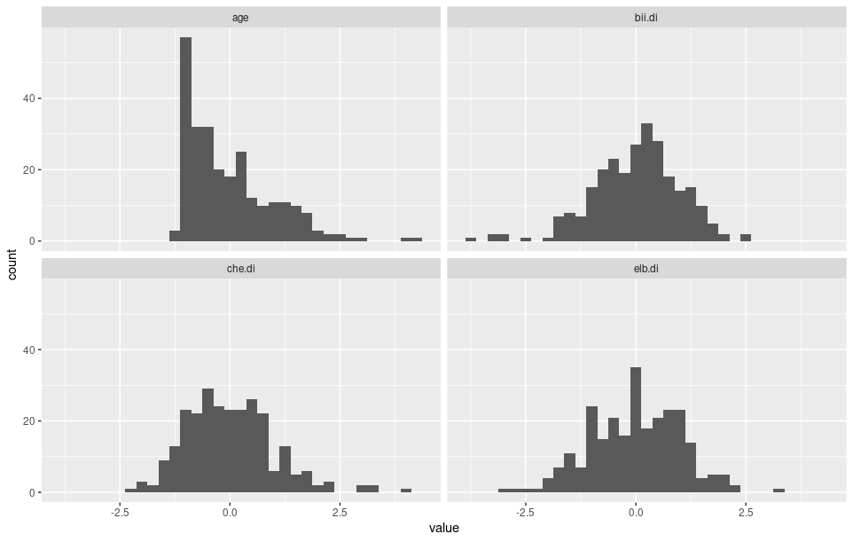

<style>
div.exercise {
    background-color: #eee;
    padding: 0.5em 1em;
    margin-top: 1em;
    margin-bottom: 1em;
    border-radius: 0.2em;
    counter-increment: exercise;
}

div.exercise::before {
    content: "Exercise " counter(lab) "." counter(exercise);
    font-weight: bold;
    font-size: small;
}

h2 {
    counter-increment: lab;
    counter-reset: exercise;
}

h2::before {
    content: "Lab " counter(lab) ": ";
}
</style>



# Labs

*Instructions.* For all of the labs, write up a complete response to each exercise under the lab. If the exercise asks you to comment on a plot, include an image of that plot. If the exercise requires you to write some code that isn't explicitly given to you, include your code. 

<div class="references" style="font-size: x-small;">
These labs are minor adaptations of the [OpenIntro labs by Andrew Bray and Mine Çetinkaya-Rundel](https://www.openintro.org/book/os/), some of which in turn are based on labs by Mark Hansen, other faculty members, and TAs at UCLA Statistics. These adaptations are all available under a [Creative Commons Attribution-ShareAlike 3.0 Unported](https://creativecommons.org/licenses/by-sa/3.0/) license.
</div>

## Introduction to R and RStudio {#one}

The goal of this lab is to introduce you to R and RStudio, which you'll be using throughout the course both to learn the statistical concepts discussed in the texbook and also to analyze real data and come to informed conclusions. To straighten out which is which: R is the name of the programming language itself and RStudio is a convenient interface. As the labs progress, you are encouraged to explore beyond what the labs dictate; a willingness to experiment will make you a much better programmer. 

This lab will begin with the fundamental building blocks of R and RStudio: the interface, reading in data, and basic commands.


The panel in the upper right contains your workspace as well as a history of the commands that you've previously entered. Any plots that you generate will show up in the panel in the lower right corner.

The panel on the left is called the console. This is where the action happens. Everytime you launch RStudio, it will have the same text telling you the version of R that you're running. Below that is the prompt, which is a request for a command. Interacting with R is all about typing commands and interpreting the output. These commands and their syntax have evolved over decades (literally) and now provide what many users feel is a fairly natural way to access data and organize, describe, and invoke statistical computations.

### Tidyverse 

The `tidyverse` is a collection of R packages that help significantly with many data-related tasks. We'll be using the `tidyverse` packages in these labs, so you'll need to install them. To do this, type the following into the console: 

```R
install.packages("tidyverse")
```

It'll take some time to install all of the packages and their dependencies, so you can step away from your computer and grab a coffee while it works. There should be a "DONE" on the screen when it finishes. 

After you install the packages, every time you start a new session you'll need to tell R that you'll be using the `tidyverse` packages. Type the following into the console to tell R that you'll doing this:

```R
library(tidyverse)
```

Remember that you'll need to type `library(tidyverse)` every time you start a new session of R! If you ever try running a command over the course of the labs and R tells you that it can't find a function or object, you're likely trying to invoke a `tidyverse` object and forgot to type `library(tidyverse)` into the console. (Note that you don't need to `install.packages("tidyverse")` every time.)

### Arbuthnot's Baptism Records

[Dr Arbuthnot](https://en.wikipedia.org/wiki/John_Arbuthnot) (1667--1735) was a physician, writer, and mathematician. He was interested in the ratio of newborn boys to newborn girls, so he gathered the baptism records for children born in London for every year from 1629 to 1710. 

This data is recorded in the [`arbuthnot.csv`]({{ prefix }}/arbuthnot.csv) file. The `csv` extension for "comma-separated values," and a `csv` file is just a plain text file format used to record data frames. The first line in the file records the variable names (separated by commas), and then each subsequent row records observations (again, separated by commas). The first few lines in `arbuthnot.csv` look like this: 

```
year,boys,girls
1629,5218,4683
1630,4858,4457
1631,4422,4102
1632,4994,4590
```

To load the data frame into R, enter the following command into R prompt: 

```R
arbuthnot <- read_csv("{{prefix}}/arbuthnot.csv")
```

The `read_csv` function tells R to read the `csv` file whose path is provided inside the brackets and quotes as a tibble (which is the modern `tidyverse` version of the data frame). That path can be a path to a `csv` file on your computer (eg, `read_csv("~/Downloads/arbuthnot.csv")`), or it can be a URL of a `csv` file on the web (like above). The `<-` symbol tells R to store the data from that `csv` file into a variable called `arbuthnot`. 

You should see that the workspace area in the upper righthand corner of the RStudio window now lists a tibble called `arbuthnot` that has 82 observations on 3 variables. You can take a look at the tibble by typing its name into the console.

```R
arbuthnot
```

R will show you something like this: 

```
# A tibble: 82 × 3
    year  boys girls
   <dbl> <dbl> <dbl>
 1  1629  5218  4683
 2  1630  4858  4457
 3  1631  4422  4102
 4  1632  4994  4590
 5  1633  5158  4839
 6  1634  5035  4820
 7  1635  5106  4928
 8  1636  4917  4605
 9  1637  4703  4457
10  1638  5359  4952
# … with 72 more rows
```

The first line tells you how many rows and columns the tibble has (namely, 82 and 3). Below that, you see the first 10 rows of the data. Each row represents a year, namely, the year specified under the `year` heading. The second and third columns record the number of boys and girls, respectively, that were baptized that year. 

Note that under the column headings, you see some `<dbl>`s. The `dbl` stands for "double," which is what R calls numbers. The `<dbl>` under each column heading tells you that the `read_csv` function read all of the columns as columns of doubles. This is reasonable for this data, and usually `read_csv` will make a reasonable decision. (In the rare situation that it doesn't make a good decision, there are ways you can tell `read_csv` how you want to read the data.) 

The final line of the output above reminds you that you're seeing a truncation of the data, and that the tibble really has 72 more lines that you're not seeing. If you'd like to see the full tibble, you have two options. You can either double-click on the name of the tibble in the Environment pane (the box on the upper right-hand side) of the RStudio interface, or you can type the following into the console: 

```R
view(arbuthnot)
```

Let's start to examine the data a little more closely. We can access the data in a single column of the tibble separately using the `$`. For example, to get a list of the numbers of boys that were baptized each year, type the following into the console: 

```R
arbuthnot$boys
```

Notice that the way R has printed these data is different. When we looked at the complete data frame, we saw 82 rows, one on each line of the display. These data are no longer structured in a table with other variables, so they are displayed one right after another. Objects that print out in this way are called *vectors*; they represent a set of numbers. R has added numbers in [brackets] along the left side of the printout to indicate locations within the vector. For example, `5218` follows `[1]`, indicating that `5218` is the first entry in the vector. And if `[43]` starts a line, then that would mean the first number on that line would represent the 43rd entry in the vector.

<div class="exercise">
What command would you use to extract just the counts of girls baptized? Try it!
</div>

### Scatterplots

The `tidyverse` package has extremely powerful and flexible tools for making statistical graphics. We can create a simple plot of the number of girls baptized per year with the following command. 

```R
ggplot(arbuthnot, aes(x = year, y = girls)) + geom_point()
```

The first `ggplot(...)` part of this command tells R to look inside the `arbuthnot` tibble, to use the `year` column of that tibble for the x-axis of the graphic, the `girls` column for the y-axis. The `+ geom_point()` part of this command tells R to make points corresponding to this data. To connect these points with lines, we can add `+ geom_line()` to the command as follows: 

```R
ggplot(arbuthnot, aes(year, girls)) + geom_point() + geom_line()
```

This time, note that we left out the `x = ` and `y = ` inside the `aes(...)`. This is because `aes` automatically understands its first argument to be the x-axis variable and the second argument to be the y-axis variable.

<div class="exercise">
Is there an apparent trend in the number of girls baptized over the years? How would you describe it?
</div>

The syntax for these `ggplot` commands might look a little confusing, because it is: it is based on a rich grammar of graphics that you can read extensively about in [this book](https://ggplot2-book.org/). For the purposes of these labs, we'll just need some basic types of plots. Most of the time, the code for making plots will be given to you explicitly (like above). Sometimes, you might need to slightly tweak some code that's given to you to get the plot you need. 

### Manipulating Data

R can be used as a calculator. If you wanted to know the total number of baptisms in 1629, you could just see that there were 5218 boy baptisms and 4683 girl baptisms, and then we could add these numbers together by typing 

```R
5218 + 4683
```

into the console to see the total number of baptisms in 1629. 

What if we wanted to know the total number of baptisms for every year? We could repeat the above process once for each year, but that would require us to type 82 different additions into the console! There are much faster ways. 

One strategy is to add together the vectors that record numbers of baptisms for boys and girls. R will compute all sums simultaneously: 

```R
arbuthnot$boys + arbuthnot$girls
```

What you will see are 82 numbers (in that packed display, because we aren't looking at a tibble here), each one representing the sum we're after. Take a look at a few of them and verify that they are right. 

Another strategy is to add a column to our `arbuthnot` tibble that records these totals. Here's one way of doing this: 

```R
arbuthnot <- mutate(arbuthnot, total = boys + girls)
```

The `mutate(...)` part above tells R to construct a new tibble that has all of the same columns as the `arbuthnot` tibble and also has a new column called `total`, which is the sum of the `boys` and `girls` columns of the original tibble. The `arbuthnot <- ` part of the command tells R to store this new tibble back into `arbuthnot`, effectively replacing our original tibble. 

We can now make a plot of total number of baptisms per year: 

```R
ggplot(arbuthnot, aes(year, total)) + geom_point() + geom_line()
```

Similarly to how we computed the proportion of boys, we can compute the ratio of the number of boys to the number of girls baptized in 1629 with

```R
5218 / 4683
```

or we can act on the complete vectors with the expression

```R
arbuthnot$boys / arbuthnot$girls
```

or we can add a new column to our tibble: 

```R
arbuthnot <- mutate(arbuthnot, ratio = boys / girls)
```

You can now make a plot of the boy-to-girl ratio over time using: 

```
ggplot(arbuthnot, aes(year, ratio)) + geom_point() + geom_line()
```

<div class="exercise">
Use `mutate` to add a column called `prop_boy` to the `arbuthnot` tibble that records the proportion of the total number of newborns that were boys. Then make a plot of the proportion of boys over time. What do you see? 

Tip: If you use the up and down arrow keys, you can scroll through your previous commands, your so-called *command history*. You can also access it by clicking on the history tab in the upper right panel. This will save you a lot of typing in the future.
</div>

Finally, in addition to simple mathematical operators like subtraction and division, you can ask R to make comparisons like greater than `>`, less than `<`, and equality `==`. For example, we can ask if boys outnumber girls in each year with the expression

```R
arbuthnot$boys > arbuthnot$girls
```

This command returns 82 values of either `TRUE` if that year had more boys than girls, or `FALSE` if that year did not (the output from the above command may surprise you!). This output shows a different kind of data than we have considered so far. In the `arbuthnot` tibble our values are numerical (the year, the number of boys and girls). Here, we've asked R to create logical data, ie, data where the values are either `TRUE` or `FALSE`. 

In general, data analysis will involve many different kinds of data types, and one reason for using R is that it is able to represent and compute with many of them.

### Another Data Set

The next few exercises involve repeating some of the above steps but for present-day birth records in the United States. These data come from [a report by the Centers for Disease Control](http://www.cdc.gov/nchs/data/nvsr/nvsr53/nvsr53_20.pdf). Check it out if you would like to read more about an analysis of sex ratios at birth in the United States.

<div class="exercise">
Load up the data in  file [`{{prefix}}/present.csv`]({{prefix}}/present.csv) using `read_csv` and store it in a variable called `present`. 
</div>

<div class="exercise">
What years are included in this data set? What are the dimensions of the data frame and what are the variable or column names?
</div>

<div class="exercise">
How do the birth counts compare to Arbuthnot's? Are they on a similar scale?
</div>

<div class="exercise">
Add a column to the `present` tibble called `ratio` which records the boy-to-girl ratio. Then make a plot that displays the boy-to-girl ratio for every year. What do you see?

Note: You may be surprised by the result, especially if you're aware of issues involving sex-selective abortion in some developing countries. You may find it useful to look through [this article](https://ourworldindata.org/gender-ratio) if you find yourself puzzled. 
</div>

<div class="exercise">
In what year did we see the most total number of births in the US? 

Hint: First add a column to `present` called `total` that records the total number of births. Then run `slice_max(present, total)` to see the "slice" (ie, the row) of the tibble which contains the maximum value under `total`. 
</div>

## Introduction to Data {#two}

In this lab, you will gain insight into public health by generating simple graphical and numerical summaries of a data set collected by the Centers for Disease Control and Prevention (CDC). As this is a large data set, along the way you'll also learn the indispensable skills of data processing and subsetting.

### Behavioral Risk Factor Surveillance System 

The Behavioral Risk Factor Surveillance System (BRFSS) is an annual telephone survey of 350,000 people in the United States. As its name implies, the BRFSS is designed to identify risk factors in the adult population and report emerging health trends. For example, respondents are asked about their diet and weekly physical activity, their HIV/AIDS status, possible tobacco use, and even their level of healthcare coverage. The [BRFSS website](http://www.cdc.gov/brfss) contains a complete description of the survey, including the research questions that motivate the study and many interesting results derived from the data.

We will focus on a random sample of 20,000 people from the BRFSS survey conducted in 2000. While there are over 200 variables in this data set, we will work with a small subset. Load the data set from the `csv` file at [`{{prefix}}/cdc.csv`]({{ prefix }}/cdc.csv): 

```R
cdc <- read_csv("{{prefix}}/cdc.csv")
```

Like in lab 1, you can now type `cdc` into the console to see the first 10 rows of the data. Each row in this tibble represents an observation, ie, a survey respondent. The variables (ie, column names) correspond to questions that were asked in the survey. For example: 

* For `genhlth`, respondents were asked to evaluate their general health, responding either `excellent`, `very good`, `good`, `fair` or `poor`. 
* The `exerany` variable indicates whether the respondent exercised in the past month (`1`) or did not (`0`). 
* `hlthplan` indicates whether the respondent had some form of health coverage (`1`) or did not (`0`). 
* The `smoke100` variable indicates whether the respondent had smoked at least 100 cigarettes in her lifetime. 

The other variables record the respondent's `height` in inches, `weight` in pounds as well as their desired weight `wtdesire`, `age` in years, and `gender`.

<div class="exercise">
How many observations are there in this data set? How many variables? Determine whether each variable is categorical or numerical. Be careful: some of the variables have entries recorded as numbers, but they aren't actually numerical variables. 
</div>

### Summaries and Tables

The BRFSS questionnaire is a massive trove of information. A good first step in any analysis is to distill all of that information into a few summary statistics and graphics. 

As a simple example, the function summary returns a numerical summary: minimum, first quartile, median, mean, second quartile, and maximum. For `weight`, this is computed as follows: 

```R
summary(cdc$weight)
```

R also has built-in functions to compute summary statistics one by one. For instance, to calculate the mean, median, and variance of weight, type

```R
mean(cdc$weight) 
var(cdc$weight)
median(cdc$weight)
```

While it makes sense to describe a quantitative variable like weight in terms of these statistics, what about categorical data? We would instead consider the sample frequency or relative frequency distribution. For example, suppose we want to see the number of people who have smoked 100 cigarettes in their lifetime. You could type the following into the console: 

```R
count(cdc, smoke100)
```

We can also make a bar plot as follows: 

```R
ggplot(cdc, aes(smoke100)) + geom_bar()
```

<div class="exercise">
Create a numerical summary for `height` and `age`, and compute the interquartile range for each. How many males are in the sample? What proportion of the sample reports being in excellent health?
</div>

The `count` command can be used to tabulate any number of variables that you provide. For example, to examine which participants have smoked across each `gender`, we could use the following.

```R
count(cdc, gender, smoke100)
```

Finally, to make side-by-side bar plots to visualize `smoke100` and `gender`, we can do the following: 

```R
ggplot(cdc, aes(factor(smoke100), fill = gender)) + geom_bar(position = "dodge")
```

<div class="exercise">
What does the side-by-side bar plot reveal about smoking habits and gender?
</div>

### Interlude: How R Thinks About Data

As we've seen, tibbles are kind of like spreadsheets where each row is a different observation (in this case, a different respondent) and each column is a different variable (`genhlth`, `exerany`, and so on). We can extract a list of the entries in a particular column using `$`, as follows:

```R
cdc$genhlth
```

This will spit out a list of 20,000 strings telling us about the general health of the survey respondents. To extract the 345th entry in this list, we can do this:

```R
cdc$genhlth[345]
```

This tells me that the 345th survey respondent reported having "excellent" health. To extract the general health of the 400th through 410th respondents, we can do this: 

```R
cdc$genhlth[400:410]
```

The syntax `400:410` generates a list of numbers from 400 to 410, and then putting those in brackets next to the list name tells R to access the entries in the 400th through 410th positions in the list. 

To extract a single row of the tibble, use the `slice` function. For example, this will return the 17th row of the data. 

```R
slice(cdc, 17)
```

To extract the 100th through 107th rows of the data, we can do this: 

```R
slice(cdc, 100:107)
```

### A little more on subsetting

It's often useful to extract all individuals (cases) in a data set that have specific characteristics. We accomplish this through filters. First, consider expressions like

```R
cdc$gender == "m"
```

or

```R
cdc$age > 30
```

These commands produce a series of `TRUE` and `FALSE` values. There is one value for each respondent, where TRUE indicates that the person was male (via the first command) or older than 30 (second command).

Suppose we want to extract just the data for the men in the sample, or just for those over 30. We can use the R function `subset` to do that for us. For example, the command

```R
mdata <- filter(cdc, gender == "m")
```

will create a new data set called `mdata` that contains only the men from the `cdc` data set. In addition to finding it in your workspace alongside its dimensions, you can take a peek at the first several rows as usual:

```R
mdata
```

This new data set contains all the same variables but just under half the rows. It is also possible to tell R to keep only specific variables, which is a topic we'll discuss in a future lab. For now, the important thing is that we can carve up the data based on values of one or more variables.

As an aside, you can use several of these conditions together with `&` and `|`. The `&` is read "and" so that

```R
filter(cdc, gender == "m" & age > 30)
```

will give you the data for men over the age of 30. The `|` character is read "or" so that

```R
filter(cdc, gender == "m" | age > 30)
```

will take people who are men or over the age of 30 or both (why that's an interesting group is hard to say, but right now the mechanics of this are the important thing). In principle, you may use as many "and" and "or" clauses as you like when forming a subset.

<div class="exercise">
Create a new object called `under23_and_smoke` that contains all observations of respondents under the age of 23 that have smoked 100 cigarettes in their lifetime. Write the command you used to create the new object as the answer to this exercise.
</div>

### Quantitative data

With our subsetting tools in hand, we'll now return to the task of the day: making basic summaries of the BRFSS questionnaire. We've already looked at categorical data such as smoke and gender so now let's turn our attention to quantitative data. Two common ways to visualize quantitative data are with box plots and histograms. We can construct a box plot for a single variable with the following command.

```R
ggplot(cdc, aes(y = height)) + geom_boxplot()
```

You can compare the locations of the components of the box by examining the summary statistics.

```R
summary(cdc$height)
```

Confirm that the median and upper and lower quartiles reported in the numerical summary match those in the graph. The purpose of a boxplot is to provide a thumbnail sketch of a variable for the purpose of comparing across several categories. So we can, for example, compare the heights of men and women with: 

```R
ggplot(cdc, aes(x = gender, y = height)) + geom_boxplot()
```

Next let's consider a new variable that doesn't show up directly in this data set: [Body Mass Index (BMI)](http://en.wikipedia.org/wiki/Body_mass_index). BMI is a weight to height ratio and can be calculated as:

$$ \text{BMI} = 703 \cdot \frac{\text{weight in lbs}}{(\text{height in ins})^2}. $$

Note: The 703 is the approximate conversion factor to change units from metric (meters and kilograms) to US customary (inches and pounds).

Let's now add a `bmi` column to our `cdc` tibble and then make box plots of `bmi` for each possible value of `genhlth`. 

```R
cdc <- mutate(cdc, bmi = 703 * (weight / height^2))
ggplot(cdc, aes(factor(genhlth), bmi)) + geom_boxplot()
```

<div class="exercise">
What does this box plot show? Pick another categorical variable from the data set and see how it relates to BMI. List the variable you chose, why you might think it would have a relationship to BMI, and indicate what the figure seems to suggest.
</div>

Finally, let's make some histograms. We can look at the histogram for the age of our respondents with the command

```R
ggplot(cdc, aes(age)) + geom_histogram()
```

Histograms are a decent way to see the shape of a single distribution, but that shape can change depending on how the data is split between the different bins. You can control the width of bins using the `binwidth` argument: 

```R
ggplot(cdc, aes(age)) + geom_histogram(binwidth = 2)
```

Note that you can flip between plots that you've created by clicking the forward and backward arrows in the lower right region of RStudio, just above the plots. 

At this point, we've done a good first pass at analyzing the information in the BRFSS questionnaire. We've found an interesting association between smoking and gender, and we can say something about the relationship between people's assessment of their general health and their own BMI. We've also picked up essential computing tools --- summary statistics, subsetting, and plots --- that will serve us well throughout this course.

<div class="exercise">
Make a scatterplot of weight versus desired weight. (You'll just want `geom_point` for this scatterplot and no `geom_line`!) Describe the relationship between these two variables.
</div>

<div class="exercise">
Create a new variable in the `cdc` tibble called `wtlossdesire` which represents the amount of weight that each survey respondent wants to lose. If a person's `wtlossdesire` is 0, what does this mean about the person's weight and desired weight? What if `wtlossdesire` is positive? Negative?
</div>

<div class="exercise">
Describe the distribution of `wtlossdesire` in terms of its center, shape, and spread, including any plots you use. What does this tell us about how people feel about their current weight?
</div>

<div class="exercise">
Using numerical summaries and a side-by-side box plot, determine if men tend to view their weight differently than women. 
</div>

<div class="exercise">
Now it's time to get creative. Find the mean and standard deviation of weight, and then determine what proportion of the weights are within one standard deviation of the mean.
</div>

## Probability {#three}

### Hot Hands

Basketball players who make several baskets in succession are described as having a *hot hand*. Fans and players have long believed in the hot hand phenomenon, which refutes the assumption that each shot is independent of the next. However, a 1985 paper by Gilovich, Vallone, and Tversky collected evidence that contradicted this belief and showed that successive shots are independent events (cf. [doi:10.1016/0010-0285(85)90010-6](https://doi.org/10.1016/0010-0285(85)90010-6)). This paper started a great controversy that continues to this day, as you can see by googling hot hand basketball.

We do not expect to resolve this controversy today. However, in this lab we'll apply one approach to answering questions like this. The goals for this lab are to (1) think about the effects of independent and dependent events, (2) learn how to simulate shooting streaks in R, and (3) to compare a simulation to actual data in order to determine if the hot hand phenomenon appears to be real.

### Saving Your Code

Click on File -> New -> R Script. This will open a blank document above the console. As you go along you can copy and paste your code here and save it. This is a good way to keep track of your code and be able to reuse it later. To run your code from this document you can copy and paste it into the console. Alternatively, you can highlight the code and either hit Cmd+Enter (Mac) or Ctrl+Enter (Windows/Linux).

You'll also want to save this script (code document). To do so click on the disk icon. The first time you hit save, RStudio will ask for a file name; you can name it anything you like. Once you hit save you'll see the file appear under the Files tab in the lower right panel. You can reopen this file anytime by simply clicking on it.

### Getting Started 

Our investigation will focus on the performance of one player: Kobe Bryant of the Los Angeles Lakers. His performance against the Orlando Magic in the 2009 NBA finals earned him the title Most Valuable Player and many spectators commented on how he appeared to show a hot hand. Let's load some data from those games and look at the first several rows.

```R
kobe <- read_csv("{{prefix}}/kobe.csv")
kobe
```

In this data frame, every row records a shot taken by Kobe Bryant. If he hit the shot (made a basket), a hit `H` is recorded in the column named `basket`; otherwise a miss `M` is recorded.

Just looking at the string of hits and misses, it can be difficult to gauge whether or not it seems like Kobe was shooting with a hot hand. One way we can approach this is by considering the belief that hot hand shooters tend to go on shooting streaks. For this lab, we define the length of a shooting streak to be the number of consecutive baskets made until a miss occurs.

For example, in Game 1 Kobe had the following sequence of hits and misses from his nine shot attempts in the first quarter:

H M | M | H H M | M | M | M

To verify this use the following command:

```R
kobe$basket[1:9]
```

Within the nine shot attempts, there are six streaks, which are separated by a "|" above. Their lengths are one, zero, two, zero, zero, zero (in order of occurrence).

<div class="exercise">
What does a streak length of 1 mean, ie, how many hits and misses are in a streak of 1? What about a streak length of 0?
</div>

Let's now define a function, `streak_lengths`, which will go take as input a sequence of `H`s and `M`s (like `kobe$basket`). It'll then output a list of all of the streak lengths. Copy the following into the console. You don't need to understand how this works, but if you're interested in programming, you'll probably enjoy trying to puzzle out what's going on here. 

```R
streak_lengths = function(seq) {
  seq <- c("M", seq, "M")
  booleanized <- (seq == "M")
  misses <- which(booleanized)
  diff(misses) - 1
}
```

Now that this function is defined, we can use  it any time we want. Let's use it to calculate all of Kobe's streak lengths and make a bar plot. 

```R
kobe_streaks <- streak_lengths(kobe$basket)
ggplot(tibble(kobe_streaks), aes(kobe_streaks)) + geom_bar()
```

Note we choose to make a bar plot (rather than a histogram) here because our variable is discrete (rather than continuous).

<div class="exercise">
Describe the distribution of Kobe's streak lengths from the 2009 NBA finals. What was his typical streak length? How long was his longest streak of baskets?
</div>

### Compared to what?

We've shown that Kobe had some long shooting streaks, but are they long enough to support the belief that he had hot hands? What can we compare them to?

To answer these questions, let's return to the idea of independence. Two processes are independent if the outcome of one process doesn't effect the outcome of the second. If each shot that a player takes is an independent process, having made or missed your first shot will not affect the probability that you will make or miss your second shot.

A shooter with a hot hand will have shots that are not independent of one another. Specifically, if the shooter makes his first shot, the hot hand model says he will have a higher probability of making his second shot.

Let's suppose for a moment that the hot hand model is valid for Kobe. During his career, the percentage of time Kobe makes a basket (i.e. his shooting percentage) is about 45%, or in probability notation,

$$ P(\text{shot 1} = \text{H})=0.45 $$

If he makes the first shot and has a hot hand (not independent shots), then the probability that he makes his second shot would go up to, let's say, 60%,

$$ P(\text{shot 2} = \text{H} \mid \text{shot 1} = \text{H})=0.60 $$

As a result of these increased probabilites, you'd expect Kobe to have longer streaks. Compare this to the skeptical perspective where Kobe does not have a hot hand, where each shot is independent of the next. If he hit his first shot, the probability that he makes the second is still 0.45.

$$ P(\text{shot 2} = \text{H} \mid  \text{shot 1} = \text{H})=0.45 $$

In other words, making the first shot did nothing to effect the probability that he'd make his second shot. If Kobe's shots are independent, then he'd have the same probability of hitting every shot regardless of his past shots: 45%.

Now that we've phrased the situation in terms of independent shots, let's return to the question: how do we tell if Kobe's shooting streaks are long enough to indicate that he has hot hands? We can compare his streak lengths to someone without hot hands: an independent shooter.

### Simulations in R

While we don't have any data from a shooter we know to have independent shots, that sort of data is very easy to simulate in R. In a simulation, you set the ground rules of a random process and then the computer uses random numbers to generate an outcome that adheres to those rules. As a simple example, you can simulate flipping a fair coin with the following.

```R
outcomes <- c("heads", "tails")
sample(outcomes, size = 1, replace = TRUE)
```

The vector outcomes can be thought of as a hat with two slips of paper in it: one slip says `heads` and the other says `tails`. The function sample draws one slip from the hat and tells us if it was a head or a tail.

Run the second command listed above several times. Just like when flipping a coin, sometimes you'll get a `heads`, sometimes you'll get a `tails`, but in the long run, you'd expect to get roughly equal numbers of each.

If you wanted to simulate flipping a fair coin 100 times, you could either run the function 100 times or, more simply, adjust the `size` argument, which governs how many samples to draw (the `replace = TRUE` argument indicates we put the slip of paper back in the hat before drawing again). Save the resulting vector of heads and tails in a new object called `sim_fair_coin`.

```R
sim_fair_coin <- sample(outcomes, size = 100, replace = TRUE)
```

To view the results of this simulation, type the name of the object and then use `fct_count` to count up the number of heads and tails:

```R
sim_fair_coin
fct_count(sim_fair_coin)
```

Since there are only two elements in outcomes, the probability that we "flip" a coin and it lands heads is 0.5. Say we're trying to simulate an unfair coin that we know only lands heads 20% of the time. We can adjust for this by adding an argument called prob, which provides a vector of two probability weights.

```R
sim_unfair_coin <- sample(outcomes, size = 100, replace = TRUE, prob = c(0.2, 0.8))
```

The `prob = c(0.2, 0.8)` indicates that for the two elements in the `outcomes` vector, we want to select the first one, `heads`, with probability 0.2 and the second one, `tails`, with probability 0.8. Another way of thinking about this is to think of the outcome space as a bag of 10 chips, where 2 chips are labeled "head" and 8 chips "tail". Therefore at each draw, the probability of drawing a chip that says "head"" is 20%, and "tail" is 80%.

<div class="exercise">
In your simulation of flipping the unfair coin 100 times, how many flips came up heads?
</div>

In a sense, we've shrunken the size of the slip of paper that says "heads", making it less likely to be drawn and we've increased the size of the slip of paper saying "tails", making it more likely to be drawn. When we simulated the fair coin, both slips of paper were the same size. This happens by default if you don't provide a prob argument; all elements in the outcomes vector have an equal probability of being drawn.

If you want to learn more about sample or any other function, recall that you can always check out its help file.

```R
?sample
```

### Simulating the Independent Shooter

Simulating a basketball player who has independent shots uses the same mechanism that we use to simulate a coin flip. To simulate a single shot from an independent shooter with a shooting percentage of 50% we type,

```R
outcomes <- c("H", "M")
sim_basket <- sample(outcomes, size = 1, replace = TRUE)
```

To make a valid comparison between Kobe and our simulated independent shooter, we need to align both their shooting percentage and the number of attempted shots.

<div class="exercise">
What change needs to be made to the sample function so that it reflects a shooting percentage of 45%? Make this adjustment, then run a simulation to sample 133 shots. Assign the output of this simulation to a new object called `sim_basket`.
</div>

Note that we've named the new vector `sim_basket`, the same name that we gave to the previous vector reflecting a shooting percentage of 50%. In this situation, R overwrites the old object with the new one, so always make sure that you don't need the information in an old vector before reassigning its name.

### Comparing Kobe to the Independent Shooter

With the results of the simulation saved as `sim_basket`, we have the data necessary to compare Kobe to our independent shooter. We can look at Kobe's data alongside our simulated data.

```R
kobe$basket
sim_basket
```

Both data sets represent the results of 133 shot attempts, each with the same shooting percentage of 45%. We know that our simulated data is from a shooter that has independent shots. That is, we know the simulated shooter does not have a hot hand.

<div class="exercise">
Using the function `streak_lengths`, compute the streak lengths of `sim_basket`. Describe the distribution of streak lengths. What is the typical streak length for this simulated independent shooter with a 45% shooting percentage? How long is the player's longest streak of baskets in 133 shots?
</div>

<div class="exercise">
If you were to run the simulation of the independent shooter a second time, how would you expect its streak distribution to compare to the distribution from the question above? Exactly the same? Somewhat similar? Totally different? Explain your reasoning.
</div>

<div class="exercise">
How does Kobe Bryant's distribution of streak lengths compare to the distribution of streak lengths for the simulated shooter? Using this comparison, do you have evidence that the hot hand model fits Kobe's shooting patterns? Explain.
</div>

## Normal Distribution {#four}

In this lab we'll investigate the probability distribution that is most central to statistics: the normal distribution. If we are confident that our data are nearly normal, that opens the door to many powerful statistical methods. Here we'll use the graphical tools of R to assess the normality of our data and also learn how to generate random numbers from a normal distribution.

### The Data

This week we'll be working with measurements of body dimensions. This data set contains measurements from 247 men and 260 women, most of whom were considered healthy young adults.

Load the `csv` file located at [`{{prefix}}/bdims.csv`]({{prefix}}/bdims.csv) and then take a quick peek at the first few rows of the data. 

```R
bdims <- read_csv("{{prefix}}/bdims.csv")
bdims
```

This tibble has so many variables that the preview cannot show us all of them. There are 25 measurements, many of which are either diameters or girths. A key to the variable names can be found at <http://www.openintro.org/stat/data/bdims.php>, but we'll be focusing on just three columns to get started: weight in kg (`wgt`), height in cm (`hgt`), and `sex` (`1` indicates male, `0` indicates female).

Since males and females tend to have different body dimensions, it will be useful to create two additional data sets: one with only men and another with only women.

```R
mdims <- filter(bdims, sex == 1)
fdims <- filter(bdims, sex == 0)
```

<div class="exercise">
Make a histogram of men's heights and a histogram of women's heights. How would you compare the various aspects of the two distributions?
</div>

### The Normal Distribution

In your description of the distributions, did you use words like bell-shaped or normal? It's tempting to say so when faced with a unimodal symmetric distribution.

To see how accurate that description is, we can plot a normal distribution curve on top of a histogram to see how closely the data follow a normal distribution. This normal curve should have the same mean and standard deviation as the data. We'll be working with women's heights, so let's store them as a separate object and then calculate some statistics that will be referenced later.

```R
fhgtmean <- mean(fdims$hgt)
fhgtsd <- sd(fdims$hgt)
```

Next we make a density histogram to use as the backdrop and use `stat_function` to overlay a normal probability curve. The difference between a frequency histogram and a density histogram is that while in a frequency histogram the heights of the bars add up to the total number of observations, in a density histogram the areas of the bars add up to 1. The area of each bar can be calculated as simply the height times the width of the bar. Using a density histogram allows us to properly overlay a normal distribution curve over the histogram since the curve is a normal probability density function. Frequency and density histograms both display the same exact shape; they only differ in their y-axis. You can verify this by comparing the frequency histogram you constructed earlier and the density histogram created by the commands below.

```R
ggplot(fdims, aes(hgt)) + 
  geom_histogram(aes(y = after_stat(density)), binwidth = 4) + 
  stat_function(fun = dnorm, args = list(mean = fhgtmean, sd = fhgtsd))
```

<div class="exercise">
Based on the this plot, does it appear that the data follow a nearly normal distribution?
</div>

### Evaluating the Normal Distribution

Eyeballing the shape of the histogram is one way to determine if the data appear to be nearly normally distributed, but it can be frustrating to decide just how close the histogram is to the curve. An alternative approach involves constructing a normal Q-Q plot (where "Q-Q" stands for "quantile-quantile"). 

```R
ggplot(fdims, aes(sample = hgt)) + geom_qq_line() + geom_qq()
```

A data set that is nearly normal will result in a normal Q-Q plot where the points closely follow the line. Any deviations from normality leads to deviations of these points from the line. The plot for female heights shows points that tend to follow the line but with some errant points towards the tails. We're left with the same problem that we encountered with the histogram above: how close is close enough?

A useful way to address this question is to rephrase it as: what do normal Q-Q plots look like for data that I know came from a normal distribution? We can answer this by simulating data from a normal distribution using rnorm.

```R
sim_norm <- rnorm(n = length(fdims$hgt), mean = fhgtmean, sd = fhgtsd)
```

The first argument indicates how many numbers you'd like to generate, which we specify to be the same number of heights in the `fdims` data set using the `length` function. The last two arguments determine the mean and standard deviation of the normal distribution from which the simulated sample will be generated. We can take a look at the shape of our simulated data set, `sim_norm`, as well as its normal Q-Q plot.

```R
ggplot(tibble(sim_norm), aes(sample = sim_norm)) + geom_qq_line() + geom_qq()
```

<div class="exercise">
Do all of the points in the simulated Q-Q plot fall on the line? How does this plot compare to the Q-Q plot for the real data?
</div>

Even better than comparing the original plot to a single plot generated from a normal distribution is to compare it to many more plots using the following function. Here's a function which generates nine Q-Q plots at the same time: one of the real data, alongside 8 simulated ones. 

```R
qq_with_sim <- function (x) {
  df <- tibble(source = "Real Data", data = x)
  for (i in 1:8) {
    sim <- rnorm(n = length(x), mean = mean(x), sd = sd(x))
    sim_df <- tibble(source = str_c("Simulation ", i), data = sim)
    df <- bind_rows(df, sim_df)
  }
  ggplot(df, aes(sample = data)) + 
    geom_qq_line() + 
    geom_qq() + 
    facet_wrap(~ source)
}
```

Copy the above into the console, and then use this function to generate nine Q-Q plots for `fdims$hgt` as follows. It may be helpful to click the zoom button in the plot window.

```R
qq_with_sim(fdims$hgt)
```

<div class="exercise">
Does the normal Q-Q plot for `fdims$hgt` look similar to the plots created for the simulated data? That is, do plots provide evidence that the female heights are nearly normal?
</div>

<div class="exercise">
Using the same technique, determine whether or not female *weights* appear to come from a normal distribution.
</div>

### Normal Probabilities

Okay, so now you have a slew of tools to judge whether or not a variable is normally distributed. Why should we care?

It turns out that statisticians know a lot about the normal distribution. Once we decide that a random variable is approximately normal, we can answer all sorts of questions about that variable related to probability. Take, for example, the question of, "What is the probability that a randomly chosen young adult female is taller than 6 feet (about 182 cm)?" (The study that published this data set is clear to point out that the sample was not random and therefore inference to a general population is not suggested. We do so here only as an exercise.)

If we assume that female heights are normally distributed (a very close approximation is also okay), we can find this probability by calculating a Z score and consulting a Z table (also called a normal probability table). In R, this is done in one step with the function pnorm.

```R
1 - pnorm(q = 182, mean = fhgtmean, sd = fhgtsd)
```

Note that the function `pnorm` gives the area under the normal curve below a given value, `q`, with a given mean and standard deviation. Since we're interested in the probability that someone is taller than 182 cm, we have to take one minus that probability.

Assuming a normal distribution has allowed us to calculate a theoretical probability. If we want to calculate the probability empirically, we simply need to determine how many observations fall above 182 then divide this number by the total sample size.

```R
sum(fdims$hgt > 182) / length(fdims$hgt)
```

Although the probabilities are not exactly the same, they are reasonably close. The closer that your distribution is to being normal, the more accurate the theoretical probabilities will be.

<div class="exercise">
Write out two probability questions that you would like to answer; one regarding female heights and one regarding female weights. Calculate the those probabilities using both the theoretical normal distribution as well as the empirical distribution (four probabilities in all). Which variable, `hgt` or `wgt`, had a closer agreement between the two methods?
</div>

<div class="exercise">
Now let's consider some of the other variables in the body dimensions data set. Using the figures below, match each of the four normal Q-Q plot below to the variable it represents from the `fdims` tibble. Histograms for the four possible variables are given below the Q-Q plots. 

Note: Values have been standardized (subtract the mean and then divide by the standard deviation), so the units will not be of any help. You will have to match shapes of the normal Q-Q plots to the shapes of the corresponding histograms. 
</div>




<div class="exercise">
As you can see, normal probability plots can be used both to assess normality and visualize skewness. Make a normal probability plot for female knee diameter (`kne.di`). Based on this normal probability plot, is this variable left skewed, symmetric, or right skewed? Use a histogram to confirm your findings.
</div>

## Sampling Distributions {#five}

In this lab, we investigate the ways in which the statistics from a random sample of data can serve as point estimates for population parameters. We're interested in formulating a sampling distribution of our estimate in order to learn about the properties of the estimate, such as its distribution.

### The Data

We consider real estate data from the city of Ames, Iowa. The details of every real estate transaction in Ames is recorded by the City Assessor's office. Our particular focus for this lab will be all residential home sales in Ames between 2006 and 2010. This collection represents our population of interest. In this lab we would like to learn about these home sales by taking smaller samples from the full population. Let's load the data.

```R
ames <- read_csv("{{prefix}}/ames.csv")
```

We see that there are quite a few variables in the data set, enough to do a very in-depth analysis. The above will throw some "parse errors," but don't worry about this: for this lab, we'll restrict our attention to just two of the variables without any parse errors, namely, the above ground living area of the house in square feet (`Gr.Liv.Area`) and the sale price (`SalePrice`). To save some effort throughout the lab, let's reassign `ames` to be the tibble which just has these two variables, and which abbreviates their names to just `area` and `price`: 

```R
ames <- transmute(ames, area = Gr.Liv.Area, price = SalePrice)
```

Let's look at the distribution of area in our population of home sales by calculating a few summary statistics and making a histogram.

```
summary(ames$area)
ggplot(ames, aes(area)) + geom_histogram(binwidth = 100)
```

<div class="exercise">
Describe this population distribution.
</div>

### The Unknown Sampling Distribution

In this lab we have access to the entire population, but this is rarely the case in real life. Gathering information on an entire population is often extremely costly or impossible. Because of this, we often take a sample of the population and use that to understand the properties of the population.

If we were interested in estimating the mean living area in Ames based on a sample, we can use the following command to survey the population.

```R
samp1 <- slice_sample(ames, n = 50)
```

This command collects a simple random sample of size 50 from the tibble `ames`, which is assigned to `samp1`. This is like going into the City Assessor's database and pulling up the files on 50 random home sales. Working with these 50 files would be considerably simpler than working with all 2930 home sales.

<div class="exercise">
Describe the distribution of the `area` variable in `samp1`. How does it compare to the distribution of the population?
</div>

If we're interested in estimating the average living area in homes in Ames using the sample, our best single guess is the sample mean.

```R
mean(samp1$area)
```

Depending on which 50 homes you selected, your estimate could be a bit above or a bit below the true population mean of 1499.69 square feet. In general, though, the sample mean turns out to be a pretty good estimate of the average living area, and we were able to get it by sampling less than 3% of the population.

<div class="exercise">
Take a second sample of size 50 and call it `samp2`. How does the mean of `samp2` compare with the mean of `samp1`? Suppose we took two more samples, one of size 100 and one of size 1000. Which would you think would provide a more accurate estimate of the population mean?
</div>

Not surprisingly, every time we take another random sample, we get a different sample mean. It's useful to get a sense of just how much variability we should expect when estimating the population mean this way. The distribution of sample means, called the sampling distribution, can help us understand this variability. In this lab, because we have access to the population, we can build up the sampling distribution for the sample mean by repeating the above steps many times. Here we will generate 5000 samples and compute the sample mean of each.

```R
samples <- tibble(size = numeric(), mean_area = numeric())

for(i in 1:5000) {
  samp <- slice_sample(ames, n = 50)
  samples <- add_row(samples, size = 50, mean_area = mean(samp$area))
}

ggplot(samples, aes(mean_area)) + 
    geom_histogram()
```

Here we use R to take 5000 samples of size 50 from the population, calculate the mean of each sample, and store each result in a tibble called `samples`. This tibble has two columns, one named `size` which records that the sample size was 50, and another named `mean_area` which records the mean of the area of houses in that sample. In the next section, we'll review how this code works.

<div class="exercise">
How many elements are there in `samples$mean_area`? Describe the sampling distribution, and be sure to specifically note its center. Would you expect the distribution to change if we instead collected 50,000 sample means?
</div>

### Interlude: The `for` Loop

Let's take a break from the statistics for a moment to let that last block of code sink in. You have just run your first `for` loop, a cornerstone of computer programming. The idea behind the `for` loop is iteration: it allows you to execute code as many times as you want without having to type out every iteration. In the case above, we wanted to iterate the two lines of code inside the curly braces that take a random sample of size 50 from area then save the mean of that sample. Without the `for` loop, this would be painful: 

```R
samples <- tibble(size = numeric(), mean_area = numeric())

samp <- slice_sample(ames, n = 50)
samples <- add_row(samples, size = 50, mean_area = mean(samp$area))

samp <- slice_sample(ames, n = 50)
samples <- add_row(samples, size = 50, mean_area = mean(samp$area))

samp <- slice_sample(ames, n = 50)
samples <- add_row(samples, size = 50, mean_area = mean(samp$area))

samp <- slice_sample(ames, n = 50)
samples <- add_row(samples, size = 50, mean_area = mean(samp$area))
```

and so on...

With the `for` loop, these thousands of lines of code are compressed into a handful of lines. We've added one extra line to the code below, which prints the variable `i` during each iteration of the for loop. Run this code.

```R
samples <- tibble(size = numeric(), mean_area = numeric())

for(i in 1:5000) {
  samp <- slice_sample(ames, n = 50)
  samples <- add_row(samples, size = 50, mean_area = mean(samp$area))
  print(i)
}
```

Let's consider this code line by line to figure out what it does. In the first line we initialized a tibble that will have two numeric columns, one called `size` and one called `mean_area`. This tibble is currently empty, but will eventually store values generated within the `for` loop.

The second line calls the `for` loop itself. The syntax can be loosely read as, "for every element `i` from 1 to 5000, run the following lines of code." You can think of `i` as the counter that keeps track of which loop you're on. Therefore, more precisely, the loop will run once when `i = 1`, then once when `i = 2`, and so on, up to `i = 5000`.

The body of the `for` loop is the part inside the curly braces, and this set of code is run for each value of `i`. Here, on every loop, we take a random sample `samp` of size 50 from area. We then add a row to the `samples` tibble which records the size of the sample (50) and the mean area of the sample (which is what `mean(samp$area)` computes). 

In order to display that this is really happening, we asked R to print `i` at each iteration. This line of code is optional and is only used for displaying what's going on while the `for` loop is running.

<div class="exercise">
To make sure you understand what you've done in this loop, try running a smaller version. Initialize a tibble called `samples_small`. Run a loop that takes a sample of size 50 from area and stores the sample mean in `samples_small`, but only iterate from 1 to 100. Print the output to your screen (type `samples_small` into the console and press enter). How many rows are there in `samples_small`? What does each row represent?
</div>

### Sample Size and the Sampling Distribution

Mechanics aside, let's return to the reason we used a `for` loop: to compute a sampling distribution, specifically, this one.

```R
ggplot(samples, aes(mean_area)) + 
    geom_histogram()
```

The sampling distribution that we computed tells us much about estimating the average living area in homes in Ames. Because the sample mean is an unbiased estimator, the sampling distribution is centered at the true average living area of the the population, and the spread of the distribution indicates how much variability is induced by sampling only 50 home sales.

To get a sense of the effect that sample size has on our distribution, let's build up two more sampling distributions: one based on a sample size of 10 and another based on a sample size of 100.

```R
for(i in 1:5000) {
  samp <- slice_sample(ames, n = 10)
  samples <- add_row(samples, size = 10, mean_area = mean(samp$area))
  samp <- slice_sample(ames, n = 100)
  samples <- add_row(samples, size = 100, mean_area = mean(samp$area))
}
```

Here we're able to use a single for loop to build two distributions by adding additional lines inside the curly braces. Note that the third line inside the `for` loop reassigns `samp`: in the first line it represents a sample of size 10, and in the third it represents a sample of size 100. In general, anytime you create an object using a name that is already in use, the old object will get replaced with the new one.

To see the effect that different sample sizes have on the sampling distribution, plot the three distributions on next to one another.

```R
ggplot(samples, aes(mean_area)) + 
    geom_histogram(binwidth = 25) + 
    facet_wrap(~ size)
```

<div class="exercise">
When the sample size is larger, what happens to the center? What about the spread?
</div>

### Home Prices

So far, we have only focused on estimating the mean living area in homes in Ames. Now you'll try to estimate the mean home price.

<div class="exercise">
Take a random sample of size 50, and use it to compute a point estimate for the population mean price. 
</div>

<div class="exercise">
Since you have access to the population, simulate the sampling distribution for $\bar{x}_{\mathrm{price}}$ by taking 5000 samples from the population of size 50 and computing 5000 sample means using a `for` loop. Plot the data, then describe the shape of this sampling distribution. Based on this sampling distribution, what would you guess the mean home price of the population to be? Finally, calculate and report the population mean.
</div>

<div class="exercise">
Change your sample size from 50 to 150, then compute the sampling distribution using the same method as above. Describe the shape of this sampling distribution. Based on this sampling distribution, what would you guess to be the mean sale price of homes in Ames?
</div>

<div class="exercise">
Comprea the two sampling distributions from the previous two exercises. Which one has a smaller spread? If we're concerned with making estimates that are more often close to the true value, would we prefer a distribution with a large or small spread?
</div>

## Confidence Intervals for Categorical Data {#six}

In August of 2012, news outlets ranging from the [Washington Post](https://www.washingtonpost.com/national/on-faith/poll-shows-atheism-on-the-rise-in-the-us/2012/08/13/90020fd6-e57d-11e1-9739-eef99c5fb285_story.html) to the [Huffington Post](https://www.huffpost.com/entry/atheism-rise-religiosity-decline-in-america_n_1777031) ran a story about the rise of atheism in America. The source for the story was a poll that asked people, "Irrespective of whether you attend a place of worship or not, would you say you are a religious person, not a religious person or a convinced atheist?" This type of question, which asks people to classify themselves in one way or another, is common in polling and generates categorical data. In this lab we take a look at the atheism survey and explore what's at play when making inference about population proportions using categorical data.

### The survey

Here is the [press release for the poll](https://github.com/OpenIntroStat/oilabs/raw/master/data-raw/atheism/Global_INDEX_of_Religiosity_and_Atheism_PR__6.pdf), conducted by WIN-Gallup International. Take a moment to review the report then address the following questions.

<div class="exercise">
In the first paragraph, several key findings are reported. Do these percentages appear to be sample statistics (derived from the data sample) or population parameters?
</div>

<div class="exercise">
The title of the report is "Global Index of Religiosity and Atheism." To generalize the report's findings to the global human population, what must we assume about the sampling method? Does that seem like a reasonable assumption?
</div>

### The Data

Turn your attention to Table 6 (pages 15 and 16), which reports the sample size and response percentages for all 57 countries. While this is a useful format to summarize the data, we will base our analysis on the original data set of individual responses to the survey. Load this data set into R with the following command.

```R
atheism <- read_csv("{{ prefix }}/atheism.csv")
```

<div class="exercise">
What does each row of Table 6 correspond to? What does each row of atheism correspond to?
</div>

To investigate the link between these two ways of organizing this data, take a look at the estimated proportion of atheists in the United States. Towards the bottom of Table 6, we see that this is 5%. We should be able to come to the same number using the atheism data.

<div class="exercise">
Using a `filter`, create a new tibble called `us12` that contains only the rows in atheism associated with respondents to the 2012 survey from the United States. Then use `count` to calculate the proportion of atheist responses in `us12`. Does it agree with the percentage in Table 6? If not, why?
</div>

### Inference on Proportions

Table 6 provides statistics, that is, calculations made from the sample of 51,927 people. What we'd like, though, is insight into the population parameters. You answer the question, "What proportion of people in your sample reported being atheists?" with a statistic; while the question "What proportion of people on earth would report being atheists?" is answered with an estimate of the parameter.

There are two main inferential tools for estimating population proportions: confidence intervals and hypothesis tests. In this lab, we'll focus on confidence intervals. 

<div class="exercise">
Write out the conditions for inference to construct a 95% confidence interval for the proportion of atheists in the United States in 2012. Are you confident all conditions are met?
</div>

Here's a function that calculates the confidence interval. Copy and paste the following code into R. (Note that there's an in-built function called `prop.test` that does something similar, but it computes a different confidence interval than the one we've learned in class! So you should use the following function.)

```R
proportion_ci = function(x, conf_level = 0.95) {
  cat("Confidence Level: ", conf_level, "\n")
  k <- sum(x)
  n <- length(x)
  phat <- k/n
  cat("Sample Proportion: ", phat, "\n")
  se <- sqrt(phat*(1-phat)/n)
  cat("Standard Error: ", se, "\n")
  zstar <- qnorm(1-(1-conf_level)/2)
  cat("Critical Z-Value: ", zstar, "\n")
  me <- zstar * se
  cat("Margin of Error: ", me, "\n")
  cat(conf_level*100, "% Confidence Interval: (", phat-me, ", ", phat+me, ")")
}
```

This code defines a function, `proportion_ci`, which takes as input a variable `x` which contains a list of boolean (ie, `TRUE` or `FALSE`) values. It also takes an optional argument, `conf_level`, to represent the confidence level; this argument defaults to 0.95 if you don't specify it. 

Let's now use this function to calculate a 95% confidence interval for the proportion of atheists in the US in 2012: 

```R
proportion_ci(us12$response == "atheist")
```

What's going on here? Remember that `us12` is a tibble, one of whose columns is `response`. The values that `response` can take are either `atheist` or `non-atheist`. The command `us12$response == "atheist"` goes through each entry of the column `us12$response` and outputs `TRUE` if that entry is `atheist` and `FALSE` otherwise. In other words, the output of `us12$response == "atheist"` is a list of boolean values. We can then feed that list of boolean values into the `proportion_ci` function. 

<div class="exercise">
Based on the R output, what is the margin of error for the estimate of the proportion of the proportion of atheists in US in 2012? What is the confidence interval? 
</div>

<div class="exercise">
Note that, since the `conf_level` argument to `proportion.ci` defaults to 0.95, we could also calculate a 95% confidence interval using the `proportion_ci` function as follows: 

```R
proportion_ci(us12$response == "atheist", conf_level = 0.95)
```

Now use `proportion_ci` to calculate a 90% confidence interval for the proportion of atheists in the US in 2012. Is this confidence interval wider or narrower? Explain why this makes sense. 
</div>

<div class="exercise">
Calculate 95% confidence intervals for the proportion of atheists in 2012 in two other countries of your choice, and report the associated margins of error. Be sure to note whether the conditions for inference are met. It may be helpful to create new data sets for each of the two countries first, and then use these data sets in the `proportion_ci` function to construct the confidence intervals (just like you did for the US above). 
</div>

### How Proportion Affects Margin of Error

Imagine you've set out to survey 1000 people on two questions: are you female? and are you left-handed? Since both of these sample proportions were calculated from the same sample size, they should have the same margin of error, right? Wrong! While the margin of error does change with sample size, it is also affected by the proportion.

Think back to the formula for the standard error: $ \mathrm{SE}=\sqrt{p(1−p)/n}$. This is then used in the formula for the margin of error for a 95% confidence interval: $$\mathrm{ME}=1.96\times \mathrm{SE}=1.96×\sqrt{p(1−p)/n}.$$ 
Since the population proportion $p$ is in this $\mathrm{ME}$ formula, it should make sense that the margin of error is in some way dependent on the population proportion. We can visualize this relationship by creating a plot of $\mathrm{ME}$ vs. $p$. 

```R
n <- 1000
ggplot() + 
  xlim(0,1) + 
  stat_function(fun = function(p) {2 * sqrt(p * (1 - p)/n)}) + 
  xlab("Population Proportion") + 
  ylab("Margin of Error")
```

<div class="exercise">
Describe the relationship between $p$ and $\mathrm{ME}$. 
</div>

### Success-failure condition

The textbook emphasizes that you must always check conditions before making inference. For inference on proportions, the sample proportion can be assumed to be nearly normal if it is based upon a random sample of independent observations and if both np≥10
and $n(1−p)\geq 10$. This rule of thumb is easy enough to follow, but it makes one wonder: what's so special about the number 10?

The short answer is: nothing. You could argue that we would be fine with 9 or that we really should be using 11. What is the "best" value for such a rule of thumb is, at least to some degree, arbitrary. However, when $np$ and $n(1−p)$ reaches 10 the sampling distribution is sufficiently normal to use confidence intervals and hypothesis tests that are based on that approximation.

We can investigate the interplay between $n$ and $p$ and the shape of the sampling distribution by using simulations. To start off, we simulate the process of drawing 5000 samples of size 1040 from a population with a true atheist proportion of 0.1. For each of the 5000 samples we compute $\hat{p}$ and then plot a histogram to visualize their distribution.

```R
p_hats <- tibble(p = numeric(), n = numeric(), p_hat = numeric())

n <- 1040
p <- 0.1
for(i in 1:5000) {
  samp <- sample(c("atheist", "non_atheist"), n, replace = TRUE, prob = c(p, 1-p))
  p_hats <- add_row(p_hats, p = p, n = n, p_hat = sum(samp == "atheist")/n)
}

ggplot(p_hats, aes(p_hat)) + geom_histogram(binwidth = 0.0025)
```

These commands build up the sampling distribution of $\hat{p}$ using the familiar `for` loop. You can read the sampling procedure for the first line of code inside the `for` loop as, "take a sample of size n with replacement from the choices of atheist and non-atheist with probabilities `p` and `1−p`, respectively." The second line in the loop says, "calculate the proportion of atheists in this sample and record this value." The loop allows us to repeat this process 5000 times to build a good representation of the sampling distribution.

<div class="exercise">
Describe the sampling distribution of sample proportions at $n=1040$ and $p=0.1$. Be sure to note the center, spread, and shape. Hint: Remember that R has functions such as mean to calculate summary statistics.
</div>

Let's now repeat the simulation three more times with modified sample sizes and proportions: 

```R
n <- 400
p <- 0.1
for(i in 1:5000) {
  samp <- sample(c("atheist", "non_atheist"), n, replace = TRUE, prob = c(p, 1-p))
  p_hats <- add_row(p_hats, p = p, n = n, p_hat = sum(samp == "atheist")/n)
}

n <- 1040
p <- 0.02
for(i in 1:5000) {
  samp <- sample(c("atheist", "non_atheist"), n, replace = TRUE, prob = c(p, 1-p))
  p_hats <- add_row(p_hats, p = p, n = n, p_hat = sum(samp == "atheist")/n)
}

n <- 400
p <- 0.02
for(i in 1:5000) {
  samp <- sample(c("atheist", "non_atheist"), n, replace = TRUE, prob = c(p, 1-p))
  p_hats <- add_row(p_hats, p = p, n = n, p_hat = sum(samp == "atheist")/n)
}

ggplot(p_hats, aes(p_hat)) + 
  geom_histogram(binwidth = 0.0025) + 
  facet_grid(p ~ n)
```

<div class="exercise">
Describe the three new sampling distributions. Based on these plots, how does $n$ appear to affect the distribution of $\hat{p}$? How does $p$ affect the sampling distribution?
</div>

<div class="exercise">
If you refer to Table 6, you'll find that Australia has a sample proportion of 0.1 on a sample size of 1040, and that Ecuador has a sample proportion of 0.02 on 400 subjects. Let's suppose for this exercise that these point estimates are actually the truth. Then given the shape of their respective sampling distributions, do you think it is sensible to proceed with inference and report margin of errors, as the reports does?
</div>

The question of atheism was asked by WIN-Gallup International in a similar survey that was conducted in 2005. (We assume here that sample sizes have remained the same.) Table 4 on page 13 of the report summarizes survey results from 2005 and 2012 for 39 countries.

<div class="exercise">
Answer the following two questions. As always, write out the hypotheses for any tests you conduct and outline the status of the conditions for inference.

<ol style="list-style: lower-alpha;">
<li>Is there convincing evidence that Spain has seen a change in its atheism index between 2005 and 2012? Hint: Create a new data set for respondents from Spain. Form confidence intervals for the true proportion of athiests in both years, and determine whether they overlap.</li>
<li>Is there convincing evidence that the United States has seen a change in its atheism index between 2005 and 2012?</li>
</ol>
</div>

<div class="exercise">
If in fact there has been no change in the atheism index in the countries listed in Table 4, in how many of those countries would you expect to detect a change (at a significance level of 0.05) simply by chance? Hint: Look in the textbook index under Type 1 error.
</div>

<div class="exercise">
Suppose you're hired by the local government to estimate the proportion of residents that attend a religious service on a weekly basis. According to the guidelines, the estimate must have a margin of error no greater than 1% with 95% confidence. You have no idea what to expect for $p$. How many people would you have to sample to ensure that you are within the guidelines? Hint: Refer to your plot of the relationship between $p$ and margin of error. Do not use the data set to answer this question.
</div>

## Confidence Intervals for Numerical Data {#seven}

### Sampling from Ames, Iowa

If you have access to data on an entire population, say the size of every house in Ames, Iowa, it's straight forward to answer questions like, "How big is the typical house in Ames?" and "How much variation is there in sizes of houses?". If you have access to only a sample of the population, as is often the case, the task becomes more complicated. What is your best guess for the typical size if you only know the sizes of several dozen houses? This sort of situation requires that you use your sample to make inference on what your population looks like.
The data

In a previous lab, we looked at the population data of houses from Ames, Iowa. Let's start by loading in that data set again.

```R
ames <- read_csv("{{prefix}}/ames.csv")
ames <- transmute(ames, area = Gr.Liv.Area)
```

Let's start with a simple random sample of size 60 from the population.

```R
samp <- slice_sample(ames, n = 60)
```

<div class="exercise">
Describe the distribution of your sample. What would you say is the "typical" size within your sample? State precisely what you interpreted "typical" to mean.
</div>

<div class="exercise">
Would you expect another student's distribution to be identical to yours? Would you expect it to be similar? Why or why not?
</div>

### Confidence intervals

One of the most common ways to describe the typical or central value of a distribution is to use the mean. In this case we can calculate the mean of the sample using

```R
sample_mean <- mean(samp$area)
```

Return for a moment to the question that first motivated this lab: based on this sample, what can we infer about the population? Based only on this single sample, the best estimate of the average living area of houses sold in Ames would be the sample mean, usually denoted as $\bar{x}$ (here we're calling it `sample_mean`). That serves as a good point estimate but it would be useful to also communicate how uncertain we are of that estimate. This can be captured by using a confidence interval.

We can calculate a 95% confidence interval for a sample mean by adding and subtracting 1.96 standard errors to the point estimate.

```R
se <- sd(samp$area) / sqrt(60)
lower <- sample_mean - 1.96 * se
upper <- sample_mean + 1.96 * se
c(lower, upper)
```

This is an important inference that we've just made: even though we don't know what the full population looks like, we're 95% confident that the true average size of houses in Ames lies between the values lower and upper. There are a few conditions that must be met for this interval to be valid.

<div class="exercise">
For the confidence interval to be valid, the sample mean must be normally distributed and have standard error $s/\sqrt{n}$. What conditions must be met for this to be true?
</div>

### Confidence levels

<div class="exercise">
What does "95% confidence" mean?
</div>

In this case we have the luxury of knowing the true population mean since we have data on the entire population. This value can be calculated using the following command:

```R
mean(ames$area)
```

<div class="exercise">
Does your confidence interval capture the true average size of houses in Ames?
</div>

<div class="exercise">
All of your classmates should have gotten a slightly different confidence interval. What proportion of those intervals would you expect to capture the true population mean? Why?
</div>

Using R, we're going to recreate many samples to learn more about how sample means and confidence intervals vary from one sample to another. Loops come in handy here! Here is the rough outline:

1. Obtain a random sample.
2. Calculate and store the sample's mean and standard deviation.
3. Repeat steps (1) and (2) 50 times.
4. Use these stored statistics to calculate many confidence intervals.

```R
n <- 60
samples <- tibble(id = numeric(), mean = numeric(), sd = numeric())

for(i in 1:50){
  samp <- slice_sample(ames, n = n)
  samples <- add_row(samples, id = i, mean = mean(samp$area), sd = sd(samp$area))
}

samples <- mutate(samples, lower = mean - 1.96 * sd / sqrt(n), 
    upper = mean + 1.96 * sd / sqrt(n))
```

The result of this code is a tibble where each row corresponds to a sample of size 60. The row records a sample `id` (just assigning a unique number to each sample), the sample `mean`, the sample standard deviation (`sd`), and the `lower` and `upper` endpoints of the confidence interval constructed from the sample. 

Here's some code for plotting many confidence intervals and highlighting the ones that don't contain the true population mean. It's not terribly important to understand. 

```R
samples %>%
  mutate(contains_true = (lower < mean(ames$area) & upper > mean(ames$area))) %>%
  ggplot(aes(x = mean, y = id, xmin = lower, xmax = upper, color = contains_true)) + 
  geom_pointrange()
```

<div class="exercise">
What proportion of your confidence intervals include the true population mean? Is this proportion exactly equal to the confidence level? If not, explain why.    
</div>

<div class="exercise">
Pick a confidence level of your choosing, provided it is not 95%. What is the appropriate critical value?
</div>
    
<div class="exercise">
Calculate 50 confidence intervals at the confidence level you chose in the previous question. You do not need to obtain new samples, simply calculate new intervals based on the sample means and standard deviations you have already collected. Plot all of the intervals and calculate the proportion of intervals that include the true population mean. How does this percentage compare to the confidence level selected for the intervals?
</div>

<!--
## Inference for numerical data {#8}

### North Carolina births

In 2004, the state of North Carolina released a large data set containing information on births recorded in this state. This data set is useful to researchers studying the relation between habits and practices of expectant mothers and the birth of their children. We will work with a random sample of observations from this data set.

### Exploratory analysis

Load the nc data set into our workspace.

```R
nc <- read.csv("{{ prefix }}/nc.csv")
```

We have observations on 13 different variables, some categorical and some numerical. The meaning of each variable is as follows.

variable 	       description
-----------------  -------------------------
`fage` 	           father's age in years.
`mage` 	           mother's age in years.
`mature`           maturity status of mother.
`weeks`	           length of pregnancy in weeks.
`premie` 	       whether the birth was classified as premature (`premie`) or full-term.
`visits` 	       number of hospital visits during `pregnancy
`marital` 	       whether mother is married or not married at birth
`gained` 	       weight gained by mother during pregnancy in pounds
`weight`	       weight of the baby at birth in pounds
`lowbirthweight`   whether baby was classified as low birthweight (`low`) or not (`not low`).
`gender`           gender of the baby, `female` or `male`
`habit`	           status of the mother as a `nonsmoker` or a `smoker`
`whitemom` 	       whether mom is `white` or `not white`


<div class="exercise">
What are the observations in this data frame? How many observations are there in our sample?
</div>

As a first step in the analysis, we should consider summaries of the data. This can be done using the summary command:

```R
summary(nc)
```

As you review the variable summaries, consider which variables are categorical and which are numerical. For numerical variables, are there outliers? If you aren't sure or want to take a closer look at the data, make a graph.

Consider the possible relationship between a mother's smoking habit and the weight of her baby. Plotting the data is a useful first step because it helps us quickly visualize trends, identify strong associations, and develop research questions.

<div class="exercise">
Make a side-by-side boxplot of `habit` and `weight`. What does the plot highlight about the relationship between these two variables?
</div>

The box plots show how the medians of the two distributions compare, but we can also compare the means of the distributions using the following function to split the weight variable into the habit groups, then take the mean of each using the mean function.

```R
by(nc$weight, nc$habit, mean)
```

There is an observed difference, but is this difference statistically significant? In order to answer this question we will conduct a hypothesis test.

<div class="exercise">
Check if the conditions necessary for inference are satisfied. Note that you will need to obtain sample sizes to check the conditions. You can compute the group size using the same by command above but replacing mean with length.
</div>

<div class="exercise">
Write the hypotheses for testing if the average weights of babies born to smoking and non-smoking mothers are different.
</div>

We'll now use the R function `t.test` to run a $t$-test for testing the hypothesis $H_0$ that $\mu_{\text{smoker}} - \mu_{\text{nonsmoker}} = 0$, where $\mu_{\text{smoker}}$ is the mean weight of babies born to smoking mothers and $\mu_{\text{nonsmoker}}$ is the mean weight of babies born to nonsmoking mothers. 

```R
t.test(nc$weight ~ nc$habit)
```


<div class="exercise">
What is the $p$-value of the $t$-test? What does this $p$-value mean? 

Note: I'm asking you to interpret the $p$-value as a probability (not to make a final conclusion about whether to reject or not reject $H_0$ based on the $p$-value). 
</div>

<div class="exercise">
What is a 95% confidence interval for $\mu_{\text{smoker}} - \mu_{\text{nonsmoker}}$? 

Note: Be careful about signs! The `t.test` function outputs a confidence interval for either $\mu_{\text{smoker}} - \mu_{\text{nonsmoker}}$ or $\mu_{\text{nonsmoker}} - \mu_{\text{smoker}}$. Which is it?
</div>

You can also use `t.test` for a single numerical variable. For example, `weeks` is the variable recording the length of the pregnancy. Run the following: 

```R
t.test(nc$weeks) 
```


<div class="exercise">
What is the 95% confidence interval for the average length of pregnancies? Interpret it in context.
</div>

<div class="exercise">
Calculate a new confidence interval for the same parameter at the 90% confidence level. You can change the confidence level by adding a new argument to the function: `conf.level = 0.90`.
</div>

<div class="exercise">
Conduct a hypothesis test evaluating whether the average weight gained by younger mothers is different than the average weight gained by mature mothers.
</div>

<div class="exercise">
Now, a non-inference task: Determine the age cutoff that was used in this study for younger and mature mothers. Use a method of your choice, and explain how your method works.
</div>

<div class="exercise">
Pick a pair of variables (one binary, one numerical) in this data set and come up with a research question evaluating the relationship between these variables. Formulate the question in a way that it can be answered using a hypothesis test and/or a confidence interval. Answer your question using the `t.test` function, report the statistical results, and also provide an explanation in plain language.
</div>

## Introduction to linear regression {#9}

### Batter up

The movie Moneyball focuses on the "quest for the secret of success in baseball." It follows a low-budget team, the Oakland Athletics, who believed that underused statistics, such as a player's ability to get on base, betterpredict the ability to score runs than typical statistics like home runs, RBIs (runs batted in), and batting average. Obtaining players who excelled in these underused statistics turned out to be much more affordable for the team.

In this lab we'll be looking at data from all 30 Major League Baseball teams and examining the linear relationship between runs scored in a season and a number of other player statistics. Our aim will be to summarize these relationships both graphically and numerically in order to find which variable, if any, helps us best predict a team's runs scored in a season.
The data

Let's load up the data for the 2011 season.

```R
mlb11 <- read.csv("{{ prefix }}/mlb11.csv")
```

In addition to `runs` scored, there are seven traditionally used variables in the data set: at-bats, hits, home runs, batting average, strikeouts, stolen bases, and wins. There are also three newer variables: on-base percentage, slugging percentage, and on-base plus slugging. For the first portion of the analysis we'll consider the seven traditional variables. At the end of the lab, you'll work with the newer variables on your own.

<div class="exercise">
What type of plot would you use to display the relationship between runs and one of the other numerical variables? Plot this relationship using the variable `at_bats` as the predictor. Does the relationship look linear? If you knew a team's `at_bats`, would you be comfortable using a linear model to predict the number of runs?
</div>

If the relationship looks linear, we can quantify the strength of the relationship with the correlation coefficient.

```R
cor(mlb11$runs, mlb11$at_bats)
```

Think back to the way that we described the distribution of a single variable. Recall that we discussed characteristics such as center, spread, and shape. It's also useful to be able to describe the relationship of two numerical variables, such as `runs` and `at_bats` above.

<div class="exercise">
Looking at your plot from the previous exercise, describe the relationship between these two variables. Make sure to discuss the form, direction, and strength of the relationship as well as any unusual observations.
</div>

### The linear model

We can use the `lm` function in R to fit the linear model (a.k.a. regression line).

```R
m1 <- lm(runs ~ at_bats, data = mlb11)
```

The first argument in the function lm is a formula that takes the form `y ~ x`. Here it can be read that we want to make a linear model of runs as a function of `at_bats`. The second argument specifies that R should look in the `mlb11` data frame to find the `runs` and `at_bats` variables.

The output of `lm` is an object that contains all of the information we need about the linear model that was just fit. We can access this information using the summary function.

```R
summary(m1)
```

Let's consider this output piece by piece. First, the formula used to describe the model is shown at the top. After the formula you find the five-number summary of the residuals. The "Coefficients" table shown next is key; its first column displays the linear model's y-intercept and the coefficient of at_bats. With this table, we can write down the least squares regression line for the linear model:

$$ \widehat{\mathrm{runs}} = −2789.2429 + 0.6305 \times \mathrm{at\_bats} $$

One last piece of information we will discuss from the summary output is the Multiple R-squared, or more simply, $R^2$. The $R^2$ value represents the proportion of variability in the response variable that is explained by the explanatory variable. For this model, 37.3% of the variability in runs is explained by at-bats.

<div class="exercise">
Fit a new model that uses `homeruns` to predict `runs`. Using the estimates from the R output, write the equation of the regression line. What does the slope tell us in the context of the relationship between success of a team and its home runs?
</div>

### Prediction and prediction errors

Let's create a scatterplot with the least squares line laid on top.

```R
plot(mlb11$runs ~ mlb11$at_bats)
abline(m1)
```

The function `abline` plots a line based on its slope and intercept. Here, we used a shortcut by providing the model `m1`, which contains both parameter estimates. This line can be used to predict $y$
at any value of $x$. When predictions are made for values of $x$ that are beyond the range of the observed data, it is referred to as extrapolation and is not usually recommended. However, predictions made within the range of the data are more reliable. They're also used to compute the residuals.

<div class="exercise">
If a team manager saw the least squares regression line and not the actual data, how many runs would he or she predict for a team with 5579 at-bats? Is this an overestimate or an underestimate, and by how much? In other words, what is the residual for this prediction?
</div>
  
### Model diagnostics

To assess whether the linear model is reliable, we need to check for (1) linearity, (2) nearly normal residuals, and (3) constant variability.

Linearity: You already checked if the relationship between runs and at-bats is linear using a scatterplot. We should also verify this condition with a plot of the residuals vs. at-bats. Recall that any code following a # is intended to be a comment that helps understand the code but is ignored by R.

```R
plot(m1$residuals ~ mlb11$at_bats)
abline(h = 0, lty = 3)  # adds a horizontal dashed line at y = 0
```

<div class="exercise">
Is there any apparent pattern in the residuals plot? What does this indicate about the linearity of the relationship between runs and at-bats?
</div>

Nearly normal residuals: To check this condition, we can look at a histogram

```R
hist(m1$residuals)
```

or a normal probability plot of the residuals.

```R
qqnorm(m1$residuals)
qqline(m1$residuals)  # adds diagonal line to the normal prob plot
```

<div class="exercise">
Based on the histogram and the normal probability plot, does the nearly normal residuals condition appear to be met?
</div>

Constant variability:

<div class="exercise">
Based on the plot in (1), does the constant variability condition appear to be met?
</div>

<div class="exercise">
Choose another traditional variable from `mlb11` that you think might be a good predictor of `runs`. Produce a scatterplot of the two variables and fit a linear model. At a glance, does there seem to be a linear relationship?
</div>

<div class="exercise">
How does this relationship compare to the relationship between runs and at_bats? Use the $R^2$ values from the two model summaries to compare. Does your variable seem to predict `runs` better than `at_bats`? How can you tell?
</div>

<div class="exercise">
Now that you can summarize the linear relationship between two variables, investigate the relationships between runs and each of the other five traditional variables. Which variable best predicts runs? Support your conclusion using the graphical and numerical methods we've discussed (for the sake of conciseness, only include output for the best variable, not all five).
</div>

<div class="exercise">
Now examine the three newer variables. These are the statistics used by the author of Moneyball to predict a teams success. In general, are they more or less effective at predicting runs that the old variables? Explain using appropriate graphical and numerical evidence. Of all ten variables we've analyzed, which seems to be the best predictor of runs? Using the limited (or not so limited) information you know about these baseball statistics, does your result make sense?
</div>

<div class="exercise">
Check the model diagnostics for the regression model with the variable you decided was the best predictor for runs.
</div>
-->
