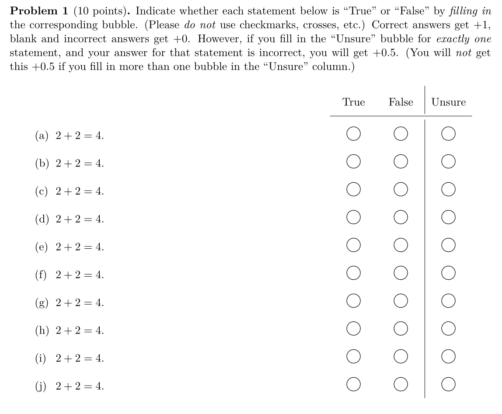

# Quizzes

There will be 5 quizzes. The first 4 will take place in class on Mondays, and the last one will take place during finals week on Wednesday (March 20) at 9am.

* Content: Quizzes will be cumulative, though they will emphasize the newest material. There will be some true-false questions and some free response questions. Expect to have to write at least one formal proof. Questions will bear strong resemblances to the ["homework" exercises](content) and the ["in-class" exercises](index#schedule). The best way to prepare is to do as many of the exercises as you can. 

* Format: You will have 50 minutes to work on the quiz. Unless I say otherwise below, no resources are allowed (no books, no computers, no notes, ...). 

## Quiz 1

It'll cover everything up through [Multivariable Polynomials](content#multivariable-polynomials). There'll be 10 true/false questions and 2 free response questions. This is what the format of the true/false will be like:

## Quiz 2

It'll cover everything up through [Polynomial Maps](content#polynomial-maps). Same format as last time. 

## Quiz 3

Details TBA

## Quiz 4

Details TBA

## Quiz 5

Details TBA
